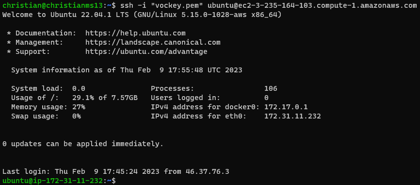
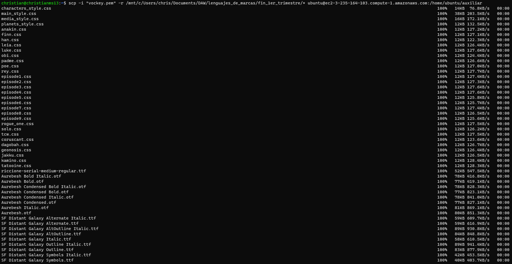

<style>
  h1{
    border: none;
    margin-bottom: 0px;
    text-align: center;
    font-weight: bold;
  }

  p{
    text-align: justify;
  }

  img{
    border: 2px solid black;
  }
</style>

<h1>AWS - EXERCISE 1</h1>

<hr>

<p><b>1. Create a new EC2 instance. Name it "UbuntuDockerAWS".</b></p>


<p><b>2. Use this EC2 instance to do the following tasks:</b></p>

<p><b>a. Access to this instance using SSH client. Create a new profile.</b></p>

<p>First, I create a new session and configure it to use my new instance's host and the default user "ubuntu". Also, I downloaded the "PPK" file, since I configured it to use a vockey.</p>


<p><b>b. Update the Ubuntu packages.</b></p>

```bash
sudo apt update -y && sudo apt upgrade -y && sudo apt auto-remove -y
```


<p><b>c. Install Docker in this server.</b></p>

```bash
sudo apt install docker.io
```


<p><b>d. Use WinSCP to transfer the content of a static web page to home directory.</b></p>

<p>I create a new SCP connection with the host in WinSCP.</p>


<p>And now I can transfer my static project to the server home directory.</p>


<p><b>e. Run a "nginx:1.22.1" docker to publish this static web page (port 80).</b></p>

```bash
sudo docker run -d -p 80:80 -v ~/fin_1er_trimestre:/usr/share/nginx/html nginx:1.22.1
```


<p>It is now possible to visit "3.235.164.103:80" and visit the page, located on the docker nginx server.</p>


<p><b>3. Now consider you are not using Windows but an Ubuntu console:</b></p>

<p><b>a. Access to previous "UbuntuDockerAWS" EC2 instance.</b></p>

<p>To be able to do this, I first need to download the "PEM" vockey file for the instance.</p>

```bash
chmod 400 labsuser.pem
```


<p>Once I have this file, I need to change it's permissions:</p>

```bash
ssh -i "labuser.pem" ubuntu@ec2-3-235-164-103.compute-1.amazonaws.com
```



<p><b>b. Copy using "scp" command a directory with another static web page to the "UbuntuDockerAWS" EC2 instance.</b></p>

<p>First of all, since I am going tu use the same web page, I need to create an additional directory in the user home of "UbuntuDockerAWS" to locate the page in there.</p>

```bash
mkdir auxiliar
```

<p>Now that I have a place to copy the page in, I can use the SCP command:</p>

```bash

```

