<style>
  h1{
    text-align: center;
    font-weight: bold;
    border: none;
    margin-bottom: 0px;
  }

  p{
    text-align: justify;
  }

  img{
    border: 2px solid black;
  }

  #ex{
    border: none;
  }
</style>

<h1>AWS EVALUATION</h1>

<hr>

<p><b>1. AWS Academy Cloud Foundations (Theory)</b></p>


<hr>

<p><b>2.a. Creación de una VPC donde instalar las instancias que vamos a usar.</b></p>

<p><b>Crear una VPC con las siguientes condiciones:</b></p>

<li><b>Se trata de montar una infraestructura para una empresa que va a tener dos subredes, una pública y otra privada. Cada una de las subredes estará dispersa en dos zonas de disponibilidad de la región para más disponibilidad y seguridad.</b></li>

<li><b>La zona pública deberá tener salida a Internet a través de un gateway propio creado para la VPC.</b></li>

<li><b>El rango de direcciones de la VPC será el CIDR 10.0.0.0/16 y cada una de las dos subredes tendrá los CIDR 10.0.1.0/24 y 10.0.2.0/24 respectivamente.</b></li>

<li><b>La subred pública se llamará "vpc_publica_test" y la privada "vpc_privada_test".</b></li>

<li><b>Se creará una tabla de enrutamiento que permita salida a Internet a la subred pública, pero no a la privada.</b></li>

<p><b>Ficha técnica:</b></p>

<li><b>Nombre VPC: vpc_< tusiniciales ></b></li>

<li><b>Subred pública: vpc_publica_test</b></li>

<li><b>Subred privada: vpc_privada_test</b></li>

<li><b>CIDR VPC: 10.0.0.0/16</b></li>

<li><b>CIDR público: 10.0.1.0/24</b></li>

<li><b>CIDR privado: 10.0.2.0/24</b></li>

<p><b>Salida a Internet (subred pública):</b></p>


<p>Lo primero es iniciar el Learner Lab del entorno de AWS.</p>


<p>Una vez dentro del panel de control, buscamos "vpc" en la barra de búsqueda y clicamos en la opción que nos llevará al menú principal para poder trabajar con las VPC.</p>


<p>Entre las opciones que ofrece este panel de control, debemos elegir primero la de crear una nueva VPC.</p>


<p>Nos encontramos con una serie de ajustes que podemos cambiar o dejar de forma predeterminada. Para empezar, marcamos la opción "VPC only" de la izquierda, ya que por ahora solo queremos crear una VPC básica.</p>

<p>Se le asigna un nombre ("vpc_< tusiniciales >"). Se establece el CIDR que nos pide el ejercicio y, por último, añadimos una etiqueta "AWSEvaluation" con valor "1daw" (esto es solo un ejemplo, la etiqueta puede ser cualquiera, simplemente debe ser identificable).</p>


<p>Esto último lo haremos siempre que se presente la opción de añadir una nueva etiqueta para poder encontrar los elementos de forma más sencilla en caso de ser necesario.</p>


<p>Hacemos clic en el botón "Create VPC" y podemos ver cómo la VPC se ha creado correctamente con los ajustes definidos.</p>


<p>El siguiente paso es dirigirse al panel lateral de la izquierda para entrar en el apartado "Subnets".</p>


<p>Una vez dentro, localizamos la opción "Create subnet", en la esquina superior derecha del menú. Hacemos clic en ella.</p>

<p>Se nos presenta un menú de creación similar al anterior para crear la subred nueva.</p>

<p>En el desplegable que aparece en el primer cuadro se debe seleccionar la VPC que creamos anteriormente:</p>

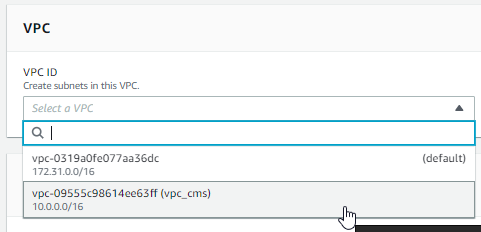

<p>De esta forma hemos vinculado la nueva subred que vamos a crear a la VPC con la que trabajaremos en este ejercicio.</p>

<p>En el siguiente cuadro aparecen nuevos ajustes. Debemos establecer un nombre para la nueva subred (tendremos que crear dos subredes, por lo que esta primera se llamará "vpc_publica_test").</p>

<p>Es importante que la zona de disponibilidad sea "US East (N. Virginia) / ...", ya que es donde se localiza la versión de AWS que tenemos disponible con nuestro correo corporativo.</p>

<p>Adicionalmente, se le asigna un rango CIDR a la subred (el cual lo da el enunciado del ejercicio) y una etiqueta nueva para tener la posibilidad de localizar este elemento de forma fácil y rápida si es necesario.</p>

<p>El rango CIDR para la subred pública es 10.0.1.0/24. Se pone la misma etiqueta en todos los elementos.</p>


<p>Terminamos de crear la nueva subred y esto nos lleva al panel de control de las subredes, donde podemos ver que la subred se ha creado con éxito.</p>


<p>Ahora es necesario realizar el mismo proceso para la subred privada, pero cambiando los valores pertinentes.</p>

<p>Se vuelve a seleccionar la VPC que creamos anteriormente en el desplegable del primer cuadro y se establece el nombre correspondiente a esta segunda subred, su rango CIDR (en este caso, 10.0.2.0/24) y su zona de disponibilidad, la cual es distinta de la anterior subred (esta zona de disponibilidad es la que termina en "us-east-1b").</p>


<p>Una vez creadas las dos subredes, volvemos al menú lateral izquierdo para entrar en el menú "Internet gateways". La subred pública debe poder salir a Internet si es necesario, para ello hace falta una puerta de enlace.</p>


<p>Seguimos el mismo proceso inicial que en los demás paneles de control y hacemos clic en el botón "Create internet gateway" en la esquina superior derecha.</p>

<p>Establecemos un nombre para la nueva puerta de enlace y la asignamos la misma etiqueta de siempre. El nombre puede seguir el patrón "gw_vpc_< tusiniciales >", por ejemplo, aunque se le puede poner cualquier nombre (preferiblemente reconocible).</p>


<p>Clicamos en el botón de creación para terminar de crear el gateway.</p>

<p>Al crearse, salimos automáticamente al panel de control, y más concretamente al apartado del propio gateway que se acaba de crear.</p>

<p>Ahora es necesario vincular esta puerta de enlace recién creada con la VPC que creamos anteriormente. Para ello debemos hacer clic en el botón "Attach to a VPC" que aparece en la esquina superior derecha justo después de terminar de crear el gateway.</p>


<p>Una vez dentro, simplemente seleccionamos nuestro VPC en el desplegable que aparece en el cuadro de ajustes.</p>


<p>Clicamos en el botón de confirmación y se vincula la puerta de enlace con la VPC.</p>

<p>Una vez más, vamos al menú lateral izquierdo, esta vez a la opción "Route tables".</p>


<p>Como venimos haciendo en cada menú, hacemos clic en el botón "Create route table" en la esquina superior derecha.</p>

<p>Para el nombre de la nueva tabla de enrutamiento podemos seguir el mismo patrón que utilizamos anteriormente, el cual es "rt_vpc_< tusiniciales >".</p>

<p>Seleccionamos de nuevo la VPC a la que se añade esta nueva tabla de enrutamiento en el desplegable, y por último, añadimos la etiqueta que utilizamos en todos los elementos.</p>


<p>Una vez hacemos clic en el botón de confirmación, aparece un menú similar al de siempre que se crea un nuevo elemento.</p>

<p>En este nuevo menú, vemos una pestaña llamada "Subnet associations". Entramos en dicha pestaña.</p>


<p>Vemos 2 cuadros llamados "Explicit subnet associations" (arriba) y "Subnets without explicit associations" (abajo). En el cuadro de arriba, clicamos en el botón "Edit subnet associations", para poder asociar la subred pública que creamos anteriormente a esta nueva tabla de enrutamiento.</p>


<p>Nos aparece una lista de las subredes que tenemos creadas. Simplemente seleccionamos la subred pública y hacemos clic en el botón de confirmación.</p>


<p>Una vez hecho, si volvemos a la pestaña "Subnet associations", podemos ver que en el cuadro de arriba ya aparece la subred que acabamos de asociar a esta tabla de enrutamiento.</p>


<p>Ahora cambiamos de pestaña a la principal, llamada "Routes".</p>

<p>En ella podemos ver otro cuadro con un botón en su esquina superior derecha que dice "Edit routes". Clicamos en él.</p>


<p>Lo que tenemos que hacer en este menú de ajustes es añadir una ruta nueva conocida como es la 0.0.0.0/0.</p>

<p>Esta ruta se encarga de que, en caso de que la dirección con la que se quiere establecer conexión no se encuentre entre el rango de IPs locales establecidas en la ruta justo encima (es decir, la comunicación no se va a establecer con un equipo local, sino con uno fuera de la red interna, un equipo de Internet), se establecerá comunicación con una IP cualquiera, que no pertenece a la red local.</p>

<p>Por lo tanto, en el primer recuadro, se establece el rango 0.0.0.0/0 y, en el segundo recuadro (el cual es un desplegable), debemos seleccionar la opción "Internet Gateway", la cual mostrará los gateways disponibles, entre los que estará el gateway que creamos anteriormente.</p>


<p>Guardamos los cambios.</p>

<p>Para terminar con la creación de la VPC, volvemos al menú lateral izquierdo, a la opción llamada "Your VPCs".</p>


<p>Nos aparece una lista de las VPCs que tenemos disponibles. Hacemos clic en la que acabamos de terminar de crear.</p>

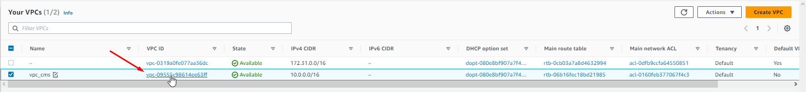

<p>Dentro de ella podemos volver a ver el resumen de la VPC configurada al completo, donde ahora aparece la tabla de enrutamiento principal, entre otras cosas:</p>

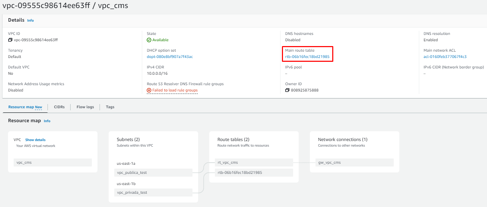

<hr>

<p><b>2.b. Una vez creada la VPC, vamos a crear una instancia EC2 en la red pública.</b></p>

<p><b>Detalles de la instancia a crear:</b></p>

<li><b>Nombre: Ubuntu_WebServer</b></li>

<li><b>Capa gratuita: instancia tipo "t2.micro", VPC: vpc_< tusiniciales >, subred: vpc_publica_test, IP local fija asignada: 10.0.1.10/24, grupo de seguridad: sg_ubuntu</b></li>

<li><b>Acceso mediante vockey con el usuario < tunombre ></b></li>

<p><b>En este equipo se debe:</b></p>

<li><b>Crear una carpeta en el workdir (/home/user) con el nombre "miweb".</b></li>

<li><b>Instalar Docker. Añade al usuario < tunombre > en el grupo "docker" para poder lanzar comandos Docker.</b></li>

<li><b>Copiar el contenido de una página web estática que tengas creada usando el correspondiente comando scp desde tu equipo y usuario Ubuntu.</b></li>

<li><b>Lanzar la instrucción "docker run", una vez tengamos el contenido web en "/home/user/miweb", para ejecutar un contenedor llamado "webserver" que ponga en contacto el directorio "/home/user/miweb" con el directorio de publicación por defecto de nginx. La imagen a usar será "nginx:1.23.3-alpine-slim". Comprueba que al visitar en un navegador "http://< ippublicaserver >" se visualiza el contenido de tu web.</b></li>

<li><b>Demostrar que, si se modifica en el equipo local la página web y se vuelve a transferir con scp este contenido a "/home/user/miweb", al visitar en cualquier navegador la página web "http://< ippublicaserver >" se visualizan los cambios.</b></li>

<p>El comienzo es similar al ejercicio anterior: buscamos "ec2" en la barra de búsqueda del panel de control y hacemos clic en el menú.</p>


<p>Creamos una nueva instancia:</p>


<p>Establecemos el nombre de la instancia y elegimos la imagen de sistema operativo que se instalará en ella.</p>


<p>El tipo de instancia lo dejamos con la opción predeterminada:</p>


<p>Seleccionamos la vockey en el siguiente desplegable, para indicar que el acceso a esta instancia se realizará mediante este método.</p>


<p>El siguiente cuadro se refiere a la configuración de la red de la nueva instancia.</p>

<p>Antes de hacer nada en este cuadro, bajamos un poco y activamos las casillas para permitir el tráfico mediante protocolos HTTP y HTTPS.</p>

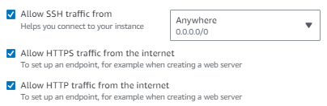

<p>Ahora debemos hacer clic en el botón de edición que aparece en la esquina superior derecha de este cuadro para cambiar algunos ajustes.</p>

<p>Lo primero ahora es cambiar la VPC que utilizará en el primer desplegable que aparece:</p>


<p>En el siguiente desplegable que aparece se selecciona la subred a la que se conecta la instancia (recordemos que tenemos una subred pública y otra privada).</p>

<p>Tenemos que asegurarnos de que la subred que está seleccionada en este desplegable es la pública, tal y como especifica el enunciado de este ejercicio.</p>


<p>También hay que habilitar la siguiente opción, que permite que la máquina obtenga una IP pública:</p>


<p>El siguiente ajuste sirve para crear un grupo de seguridad que, como especifica el enunciado de este ejercicio, debe ser "sg_ubuntu".</p>


<p>Justo después aparece la opción de crear reglas para el grupo de seguridad, las cuales se deben dejar tal cual vienen de forma predeterminada, ya que habilita el puerto para el protocolo ssh.</p>

<p>Por último en este cuadro de configuración de la red de la instancia, tendremos que abrir el último desplegable para cambiar un ajuste extra.</p>

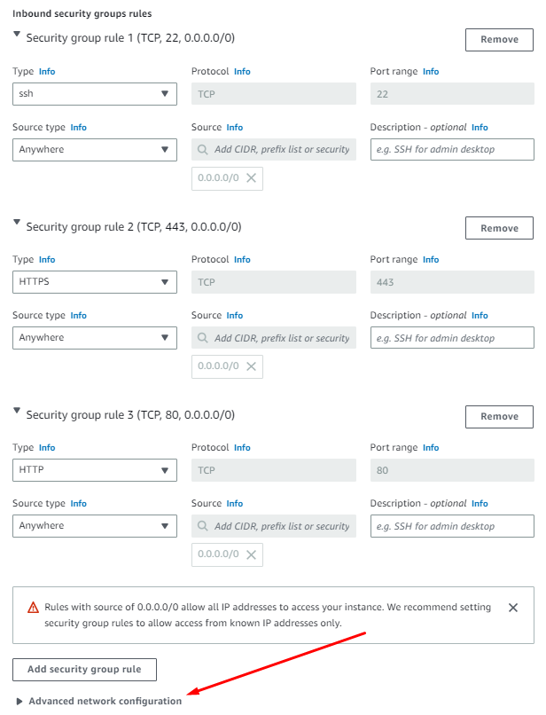

<p>Nada más abrirlo vemos que aparece una interfaz ya creada. El único ajuste que debemos tocar aquí es la IP primaria fija que se le asignará a la instancia, la cual es la 10.0.1.10, según especifica el enunciado de este ejercicio.</p>


<p>En el siguiente cuadro, debemos establecer el tamaño del almacenamiento de la instancia, donde establecemos 30 GB de almacenamiento, que es el máximo espacio de almacenamiento gratuito que ofrece nuestro plan en AWS.</p>

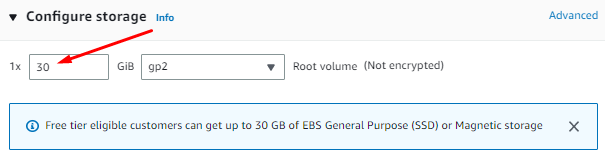

<p>Una vez configurada la nueva instancia, podemos hacer clic en el botón de confirmación y esperar a que se inicie por primera vez la máquina.</p>

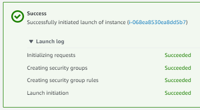

<p>Si volvemos al panel de control de instancias de EC2 y hacemos clic en el token azul de la instancia que acabamos de crear, podemos ver un resumen de la configuración:</p>

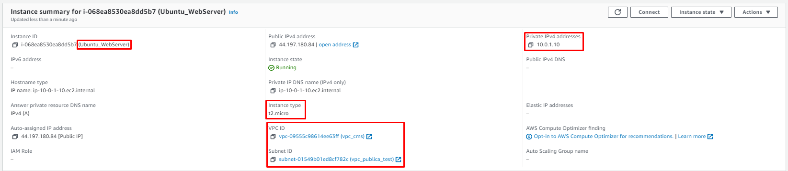

<p>La siguiente parte de este ejercicio requiere que establezcamos conexión con la máquina para poder interactuar con ella.</p>

<p>Para ello, podemos utilizar clientes SSH como Putty o MobaXterm, por ejemplo.</p>

<p>En mi caso, utilizo MobaXterm (el proceso es muy similar y parecido en Putty). Creamos un nuevo perfil de conexión, indicamos el host al que queremos conectarnos (IP pública de la instancia, que aparece en el resumen que acabamos de ver), el usuario con el que se inicia sesión en la máquina (de forma predeterminada, Ubuntu crea el usuario "ubuntu") y la clave vockey con extensión "ppk" que autentifica la conexión</p>

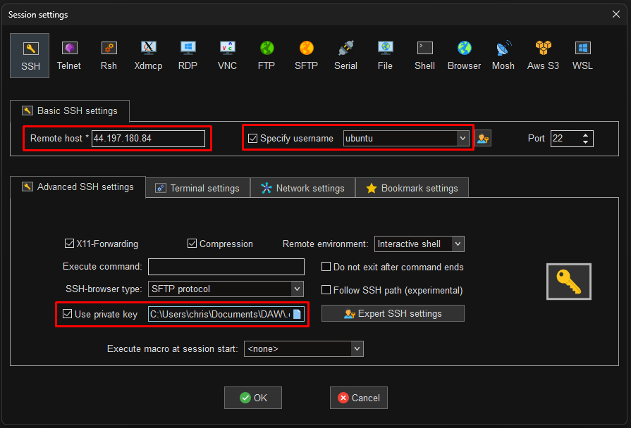

<p>Una vez se autentifica todo sin problema, ya tenemos acceso al terminal de comandos de la máquina de Ubuntu.</p>

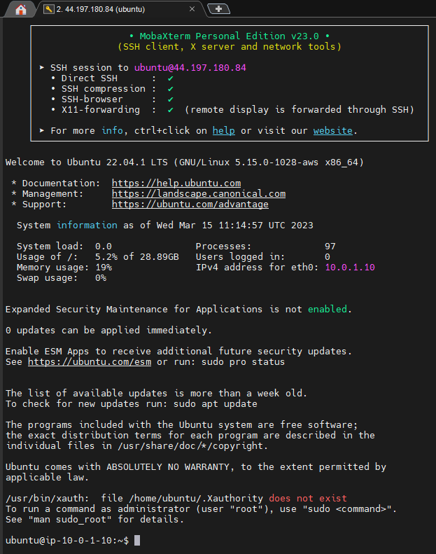

<p>Lo primero y más recomendable es ejecutar el siguiente comando nada más iniciar la máquina:</p>

```bash
sudo apt update -y && sudo apt upgrade -y && sudo apt auto-remove -y
```

<p>Este comando "pone al día" a la máquina, actualizando sus dependencias y llevando el sistema operativo a la última versión.</p>

<p>Si aparece algún cuadro con opciones, etc., simplemente se le da a ENTER (OK) sin tocar nada hasta que termine la actualización y volvamos a tener el control del terminal de forma normal.</p>

<p>Adicionalmente, con el comando "<code>ip a</code>" podemos ver la IP fija establecida en la configuración de la instancia antes de crearla.</p>

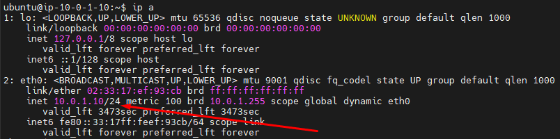

<p>Como especifica este ejercicio, el usuario a utilizar debe llamarse "< tunombre >", por lo que vamos a crearlo.</p>

<p>Para ello, debemos utilizar el siguiente comando:</p>

```bash
sudo adduser < username >
```

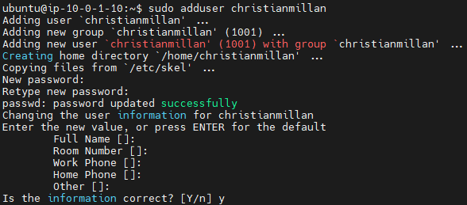

<p>Lo siguiente es instalar Docker en esta máquina, lo cual se hace con el siguiente comando:</p>

```bash
sudo apt install docker.io -y
```

<p>Igual que antes (y siempre que pase en esta práctica), si aparecen cuadros con una serie de ajustes o advertencias, se hace clic en ENTER (OK) hasta que termine la instalación sin tocar ningún ajuste.</p>

<p>El ejercicio pide que el usuario personal recién creado se incluya en el grupo "docker", lo que permitirá a este usuario ejecutar comandos de Docker sin necesidad de escribir "sudo" delante de cada comando.</p>

<p>El cambio de grupo se hace con el siguiente comando:</p>

```bash
sudo adduser < username > docker
```

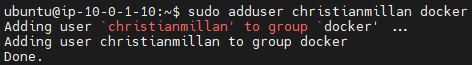

<p>De ahora en adelante, utilizaremos el usuario personal que ahora sí tiene acceso a los comandos de Docker. Para ello, debemos cambiar de usuario con el siguiente comando:</p>

```bash
su < username >
```

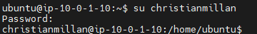

<p>Lo siguiente que pide este ejercicio es que creemos el directorio "miweb" en el directorio personal del usuario que hemos creado. Para hacer esto, ejecutamos el siguiente comando desde el home de nuestro usuario:</p>

```bash
mkdir miweb
```

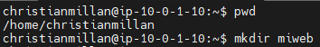

<p>El siguiente paso es transferir el contenido de una página web con contenido dentro del directorio "miweb", todo esto utilizando el subsistema de Ubuntu instalado en Windows.</p>

<p>Iniciamos el subsistema de Ubuntu en Windows.</p>

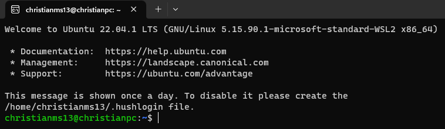

<p>Nos dirigimos al directorio donde se encuentra el contenido de la página web, en mi caso con el siguiente comando:</p>

```bash
cd /mnt/c/Users/chris/Documents/DAW/lenguajes_de_marcas
```

<p>Una vez dentro de este directorio, es necesitamos utilizar la vockey con extensión "pem" para transferir estos archivos. Para hacer esto, primero debemos cambiar los permisos del archivo "vockey.pem".</p>

<p>Lo primero es copiar el archivo desde el directorio donde lo tengamos guardado al directorio home del usuario del subsistema de Ubuntu. En mi caso el comando es el siguiente:</p>

```bash
cp /mnt/c/Users/chris/Documents/DAW/.extra/clave\ aws/vockey.pem /home/christianms13
```

<p>Una vez tenemos el archivo en el home de Ubuntu, le cambiamos los permisos:</p>

```bash
chmod 400 /home/christianms13/vockey.pem
```

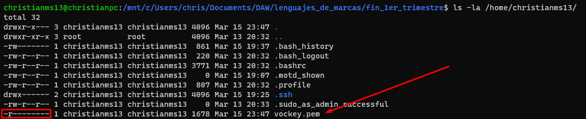

<p>Lo suyo sería utilizar el comando scp para transferir los archivos directamente al directorio "miweb" en el home del usuario personal creado anteriormente en la instancia, pero después de intentarlo de muchas maneras siempre me da un error de public key.</p>

<p>La forma que he decidido utilizar es la siguiente:</p>

<p>Transferimos los archivos al directorio home del usuario "ubuntu" (usuario que se crea de forma predeterminada con la máquina) y después se mueven esos archivos al directorio "miweb" del usuario con nombre.</p>

<p>Para ello, primero ejecutamos la transferencia de archivos. En mi caso el comando es el siguiente:</p>

```bash
scp -r -i "/home/christianms13/vockey.pem" fin_1er_trimestre/* ubuntu@75.101.247.212:/home/ubuntu/
```

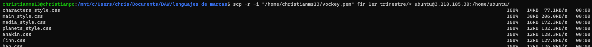

<p>Y ahora desde el cliente SSH (MobaXterm, Putty, etc.), ejecutamos el comando "<code>exit</code>" para volver al usuario "ubuntu".</p>

<p>Por último, ya desde este usuario, ejecutamos el comando "<code>mv</code>" para trasladar todo el contenido transferido por scp al directorio "miweb". Mi comando se ve así:</p>

```bash
sudo mv css/ font/ img/ index.html js/ pages/ readme/ /home/christianmillan/miweb/
```

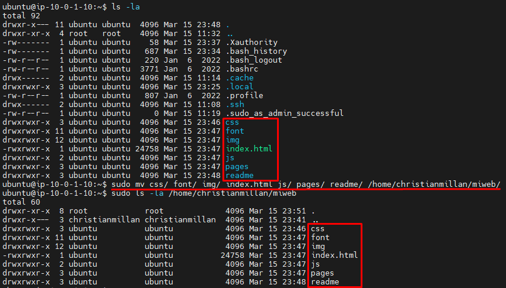

<p>Para seguir con ele ejercicio, debemos utilizar la instrucción "<code>docker run</code>" para crear un contenedor nuevo que ponga en contacto el directorio "miweb" con el directorio de alojamiento de páginas web de nginx.</p>

<p>Para empezar, volvemos a iniciar sesión como el usuario personal en la instancia:</p>

```bash
su < username >
```

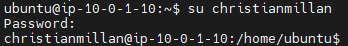

<p>Ahora ejecutamos el siguiente comando para crear el nuevo contenedor y alojar la página web directamente:</p>

```bash
docker run --name webserver -d -p 80:80 -v ~/miweb:/usr/share/nginx/html nginx:1.23.3-alpine-slim
```


<p>Y aquí podemos ver la lista de los contenedores:</p>

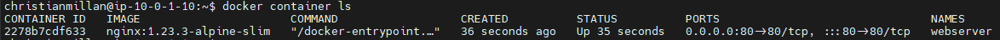

<p>Debido a que en la configuración de la instancia habilitamos el tráfico mediante protocolos HTTP, podemos visitar la página web que acabamos de alojar en un contenedor con nginx ingresando la url "http://< ippublicaserver >:80". En mi caso la url es "http://75.101.247.212:80" (en el momento de hacer este ejercicio, ya que cada vez que el Learner Lab se reinicia, se cambia l IP pública de las instancias), y se ve así:</p>

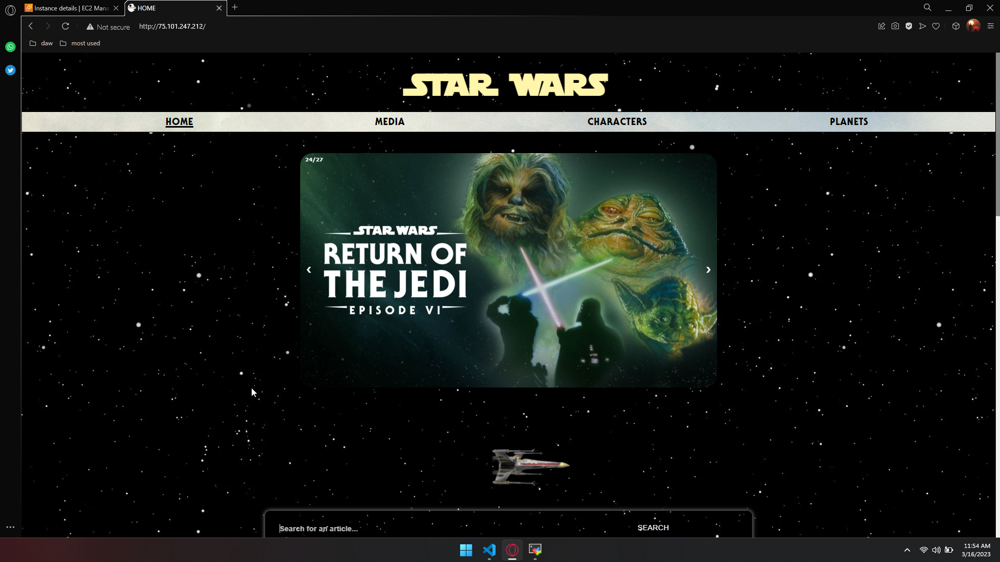

<p>Para comprobar que cualquier cambio que se realice en la página web se ve reflejado en la página en el navegador, debemos hacer lo siguiente:</p>

<p>Lo primero es realizar un cambio en el código de la página web. En mi caso, voy a cambiar el título que aparece en la página, el cual dice "STAR WARS" ahora mismo, para que ponga "EJERCICIO AWS Y DOCKER". Aquí está el código actualizado:</p>

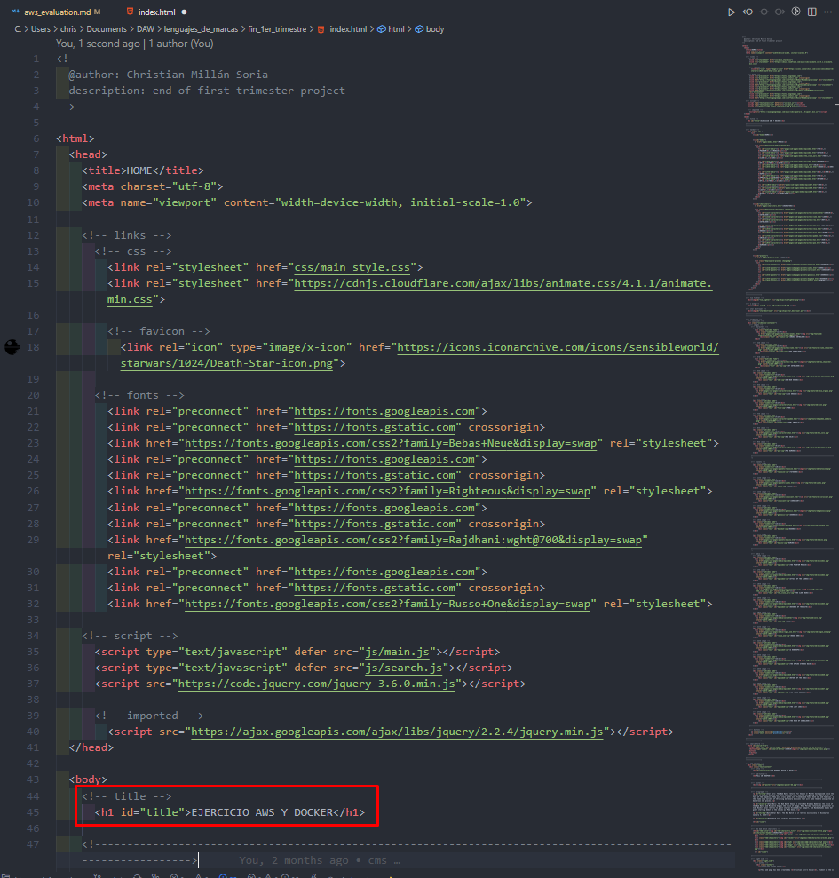

<p>Ahora volvemos a ejecutar el comando scp para subir los cambios al servidor Ubuntu (esta vez solo el archivo "index.html").</p>

```bash
scp -r -i "/home/christianms13/vockey.pem" fin_1er_trimestre/index.html ubuntu@75.101.247.212:/home/ubuntu/
```

<p>Desde la instancia ejecutamos el comando "<code>exit</code>" para volver al usuario "ubuntu". Primero elimino el archivo "index.html" del directorio "miweb" y después muevo el recién modificado index a dicho directorio de nuevo.</p>

```bash
sudo rm /home/christianmillan/miweb/index.html
```

```bash
sudo mv index.html /home/christianmillan/miweb/
```

<p>Como se puede ver a continuación, los cambios se han realizado y actualizado con éxito:</p>

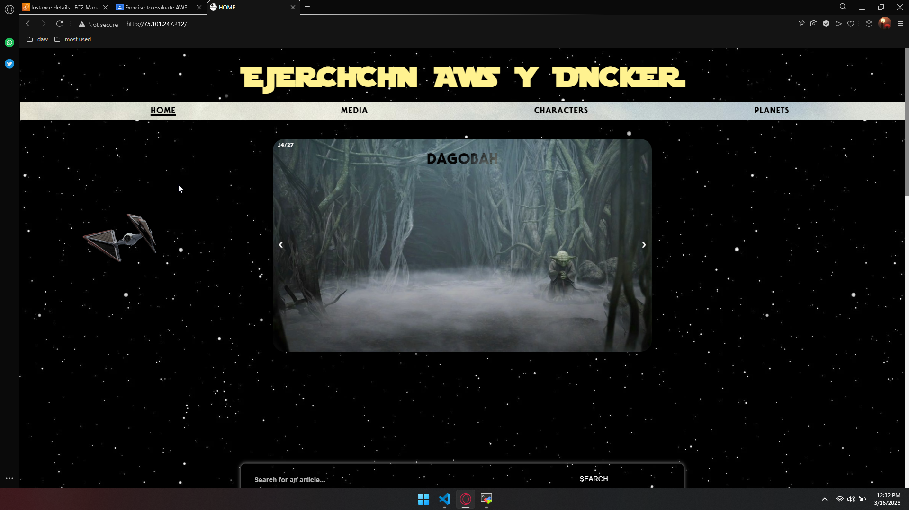

<hr>

<p><b>2.c. Buckets en AWS S3:</b></p>

<p><b>Desde la consola del "UbuntuWebServer", lanza las instrucciones "aws s3" necesarias para crear un bucket S3 donde sincronizar tu workdir es este bucket llamado "< misiniciales >backup".</b></p>

<p>Si no estamos en el usuario "ubuntu", ejecutamos el comando "<code>exit</code>" para salir del usuario personal, ya que no tiene permisos suficientes.</p>

<p>Una vez estamos en el usuario "ubuntu", ejecutamos el siguiente comando para instalar AWS CLI en la instancia:</p>

```bash
sudo apt install awscli -y
```

<p>De nuevo, pulsamos ENTER (OK) cada vez que sea necesario sin tocar ningún ajuste.</p>

<p>Cuando se termine de instalar, debemos configurar las credenciales de AWS CLI.</p>

<p>En la consola de la instancia, entramos de nuevo en el usuario personal. Mi comando es el siguiente:</p>

```bash
su christianmillan
```

<p>Desde este usuario tenemos que ejecutar el siguiente comando para crear el directorio de configuración en nuestro workdir:</p>

```bash
mkdir ~/.aws
```

<p>Dentro de este nuevo directorio deberemos crear 2 archivos de confiuración: uno para la región de nuestra cuenta y otro para las credenciales. Empezamos por el de la región.</p>

<p>Ejecutamos el siguiente comando para crear el archivo:</p>

```bash
nano ~/.aws/config
```

<p>Se nos abrirá el editor para incluir contenido dentro del archivo. El contenido es el siguiente:</p>

```bash
[default]
region = us-east-1
```

<p>El contenido anterior se debe escribir tal cual aparece aquí dentro del archivo que hemos creado.</p>

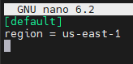

<p>Para guardar pulsamos primero "CTRL+O", después ENTER y después "CTRL+X".</p>

<p>Ahora pasamos al siguiente archivo, con el siguiente comando:</p>

```bash
nano ~/.aws/credentials
```

<p>El contenido que debe tener este fichero aparece en la pestaña de "AWS Details" al entrar en los módulos del Learner Lab</p>

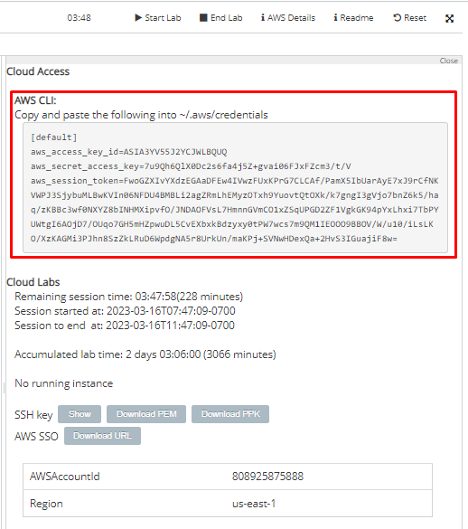

<p>Contenido del fichero en mi caso:</p>

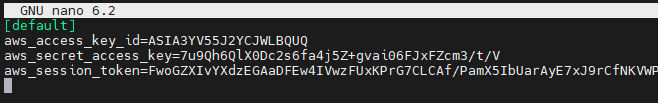

<p>Ahora el comando "<code>aws configure</code>" utilizará estos valores predeterminados para configurar las credenciales con el AWS CLI.</p>

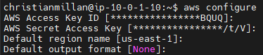

<p>*No se introduce nada en ninguno de los campos que se piden, ya que se establecen de forma predeterminada.</p>

<p>Ahora, con el siguiente comando creamos el nuevo bucket. Debido a que el nombre que me corresponde siguiendo las indicaciones del enunciado de este ejercicio ya está cogido, he tenido que cambiar el nombre, pero siguiendo utilizando mis iniciales:</p>

```bash
aws s3 mb s3://ejfinalcms
```

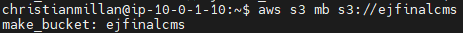

<p>Y, por último, con el siguiente comando sincronizamos el workdir de nuestro usuario personal de la instancia de AWS con el bucket recién creado:</p>

```bash
aws s3 sync . s3://ejfinalcms
```

<p>El punto "." hace referencia al directorio actual en el que estamos, por lo que tenemos que asegurarnos que estamos en el directorio home de nuestro usuario personal.</p>