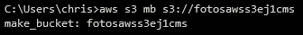
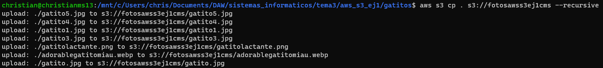
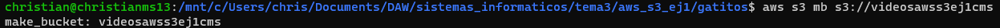
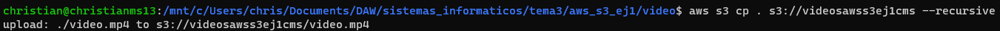
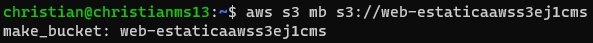
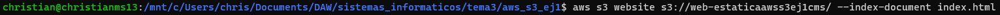
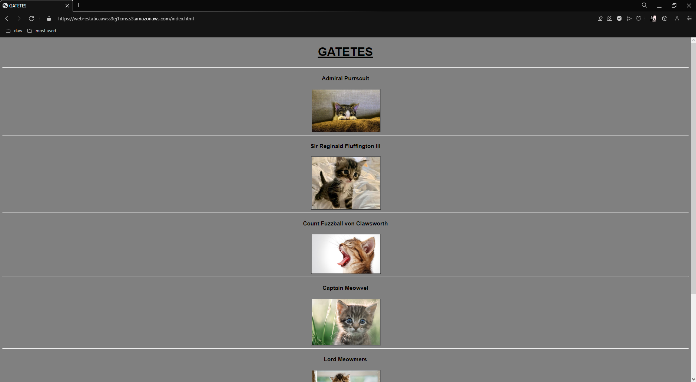
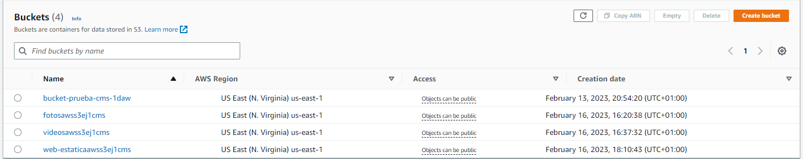

<style>
  h1{
    text-align: center;
    font-weight: bold;
    border: none;
    margin-bottom: 0px;
  }

  p{
    text-align: justify;
  }

  img{
    border: 2px solid black;
  }
</style>

<h1>AWS S3 EX1</h1>

<hr>

<p><b>1. Connect to AWS S3, explain the steps you need to do to create a bucket called "fotos" and upload the content inside the "gatitos.zip" file.</b></p>

```bash
aws s3 mb s3://fotosawss3ej1cms
```



<p>And now I can use the following command located in the directory created when decompressing the file "gatitos.zip", where all the photos are.</p>

```bash
aws s3 cp . s3://fotosawss3ej1cms --recursive
```



<p><b>2. Create a new bucket called "videos" that has version control, is public and that hosts the video "video.mp4".</b></p>

```bash
aws s3 mb s3://videosawss3ej1cms
```



<p>From the "video" directory...</p>

```bash
aws s3 cp . s3://videosawss3ej1cms --recursive
```



<p><b>3. Using the web console, create another public bucket called "web-estatica".</b></p>

```bash
aws s3 mb s3://web-estaticaawss3ej1cms
```



<p><b>This bucket must host an "index.html" file, which contains all the photos an videos located on the previous buckets.</b></p>

<p>First, I create a new index file. Its code:</p>

```html
<!DOCTYPE html>

<html>
  <head>
    <title>GATETES</title>

    <style>
      html{
        font-family: arial;
        background-color: gray;
      }

      h1{
        text-align: center;
        font-weight: bold;
        font-size: 40px;
        text-decoration: underline;
      }

      h4{
        text-align: center;
        font-size: 19px;
      }

      img{
        position: relative;
        height: 18%;
        width: 10%;
        left: 45%;
        border: 2px solid black;
        transition: 1s ease all;
      }

      img:hover{
        transition: 1s ease all;
        border: 2px solid white;
        scale: 1.1;
      }

      .video{
        position: relative;
        left: 48%;
        text-align: center;
        font-size: 30px;
        color: orange;
        text-decoration: none;
        font-weight: bold;
        transition: 1s ease all;
      }

      .video:hover{
        transition: 1s ease all;
        text-decoration: underline;
      }
    </style>
  </head>

  <body>
    <h1>GATETES</h1>

    <hr>

    <h4>Admiral Purrscuit</h4>

    <a target="_blank" href="https://fotosawss3ej1cms.s3.amazonaws.com/gatito.jpg"></a>

    <hr>

    <h4>Sir Reginald Fluffington III</h4>

    

    <hr>

    <h4>Count Fuzzball von Clawsworth</h4>

    

    <hr>

    <h4>Captain Meowvel</h4>

    

    <hr>

    <h4>Lord Meowmers</h4>

    

    <hr>

    <h4>Bartolo</h4>

    

    <hr><hr><hr>

    <a class="video" target="_blank" href="https://videosawss3ej1cms.s3.amazonaws.com/video.mp4">VIDEO</a>
  </body>
</html>
```

<p><b>4. Configure the last bucket for it to be able to host static web pages.</b></p>

<p>First thing I need to do is to make my bucket public.</p>

```bash
aws s3api put-public-access-block --bucket web-estaticaawss3ej1cms --public-access-block-configuration "BlockPublicAcls=false,IgnorePublicAcls=false,BlockPublicPolicy=false,RestrictPublicBuckets=false"
```



<p>And now I can provide the index file to the bucket:</p>

```bash
aws s3 website s3://your-bucket-name/ --index-document index.html
```



<p>Finally, my bucket is available on the web.</p>


<p><b>5. Create a screenshot that demonstrates that you can check all your instances.</b></p>

