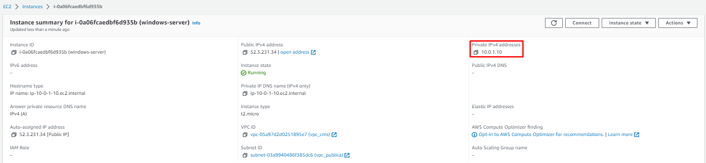

<h1>AWS VPC EX1</h1>

<h2><b>Preguntas qye hemos de saber responder:</b></h2>

<b>Dada la IPv4 172.31.15.6/20...</b>

<li><b>¿A qué red pertenece? ¿Cuál es su máscara?</b></li>

<li><b>¿Cuál es el nº de hosts que puede soportar?</b></li>

<li><b>¿Cuál es la primera IP asignable?</b></li>

<li><b>¿Cuál es la dirección de broadcast?</b></li>

<li><b>¿Cuál sería la última IP asignable?</b></li>

<b>3. Vamos a crear un VPC con las siguientes condiciones:</b>

<b>Se trata de montar una infraestructura para una empresa que va a tener dos subredes: una pública y otra privada. Cada una de las subredes estará dispersa en dos zonas de disponibilidad de la región para más disponibilidad y seguridad.</b>

<b>La zona pública deberá tener salida a Internet a través de una gateway propio creado ad-hoc para el VPC.</b>

<b>El rango de direcciones del VPC será el CIDR 10.0.0.0/16 y cada una de las dos subredes pública y privada tendrán los CIDR 10.0.1.0/24 y 10.0.2.0/24 respectivamente.</b>

<b>Las subredes públicas se llamarán "publica_vpc" y "privada_vpc".</b>

<b>Se creará una tabla de enrutamiento que permita salida a Internet a la subred pública, pero no a la privada.</b>

En la barra de búsqueda de AWS, buscamos "VPC" y entramos al panel de control de dicha herramienta. Aquí se nos presenta la posibilidad de crear un nuevo VPC:

Elegimos la opción "VPC only", ya que por ahora solo queremos crear una VPC básica. Le asignamos un nombre reconocible (en mi caso, "vpc_mis-iniciales"), establecemos el CIDR que nos pide el ejercicio y añadimos una etiqueta "Ejercicio" con valor "1daw" (esto último lo haremos siempre que se presente la opción de añadir una nueva etiqueta para poder encontrar los elementos de forma más sencilla en caso de ser necesario).

Ya se ha creado el nuevo VPC.

Ahora nos dirigimos al menú lateral a la izquierda de la página y entramos en la opción "Subnets/Subredes".

Elegimos la opción para crear una nueva subred que aparece en el panel de control de las subredes. Elegimos el VPC al que se le va a crear una subred en el desplegable que aparece.

Además de esto, le asignamos un nombre reconocible a la subred ("vpc_publica", en este caso), la zona de disponibilidad y el rango de IP de la misma.

Subred creada con éxito.

Hacemos lo mismo para la subred privada que también tenemos que crear y le asignamos el rango de IP correspondiente, distinto de la anterior subred.

Aquí se pueden identificar sin problemas las dos subredes recién creadas:

Volvemos al menú lateral izquierdo, esta vez para entrar en "Internet gateways/Puertas de enlace a Internet".

Debemos crear una puerta de enlace nueva para poder salir a Internet, no solo tener conexión interna entre equipos.

Una vez creada, hacemos clic en la opción superior derecha para agregar este gateway a nuestro VPC.

Simplemente seleccionamos el VPC creado anteriormente en el desplegable.

De nuevo vamos al menú de la izquierda, a la opción "Route tables/Tablas de enrutamiento".

Creamos una nueva tabla de enrutamiento:

Le asignamos un nombre y un VPC donde se va a usar.

Una vez creada, vamos al submenú "Subnet associations/Asociaciones de subredes".

Editamos las asociaciones...

Seleccionamos la subred que debe tener acceso a dicha tabla de enrutamiento.

Y podemos ver que se ha añadido correctamente dicha subred:

Entramos en el submenú "Routes/Rutas".

Establecemos una ruta conocida como es la "0.0.0.0/0", la cual se encarga de que, en caso de no encontrarse entre la lista de IPs locales establecida en la ruta justo encima (es decir, la comunicación no se va a establecer con un equipo local, sino con uno de fuera de la red interna, un equipo de Internet), se establecerá comunicación con una IP cualquiera, que no pertenece a la red local.

Podemos ver como se ha establecido la nueva ruta con éxito:

Viendo la vista general del VPC por ahora, se puede observar la nueva tabla de enrutamiento vinculada a este VPC:

Por último, solo queda crear una nueva instancia que utilice el VPC que acabamos de crear.

Le asignamos un nombre y un sistema operativo de Windows.

Le asignamos el par de claves "vockey" que ya hemos utilizado anteriormente con máquinas de Linux (sirve tanto para Linux como para Windows, como para otros S.O., ya que se vincula a la cuenta de AWS).

Creamos un grupo de seguridad donde se asigna el VPC que hemos creado, la subred (en este caso la pública), se habilita la asignación de IPs públicas automática y se establece un nombre para el nuevo grupo de seguridad.

También debemos crear unas reglas para el grupo de seguridad que permitan utilizar los puertos y protocolos necesarios para compartir ficheros, realizar pings, etc.

Una vez se inicializa la máquina...

... vemos como la IP fija que se le ha establecido en la configuración de la instancia se ha realizado con éxito:

Utilizamos la opción "Connect/Conectar" que aparece en la barra de menú superior de la instancia.

Abajo, en el apartado "Password7Contraseña", debemos seleccionar el archivo "vockey.pem/labuser.pem" que debemos tener descargado debido a que lo hemos utilizado anteriormente con máquinas de Linux en AWS. Este es el fichero que genera la clave para la conexión por Escritorio Remoto hacia la máquina nueva. Copiamos la contraseña/el token que este archivo genera.

Por último, seleccionamos la opción de descarga del archivo que permite la conexión a esta nueva instancia utilizando esta contraseña.

Introducimos las credenciales (la contraseña/el token que acabamos de copiar).

Y ya tenemos conexión directa por Escritorio Remoto hacia esta nueva instancia que pertenece a una red que acabamos de crear.

