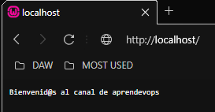

<style>
  h1{
    border: none;
    margin-bottom: 2px;
    text-align: center;
    font-weight: bold;
  }

  img{
    border: 2px solid black;
  }

  p{
    text-align: justify;
  }
</style>

<h1>DOCKER - E1</h1>

<hr>

<p><b>1. Download a 19-alpine version node image from DockerHub. Node.js is a JavaScript runtime environment.</b></p>

```bash
docker pull node:19-alpine
```


<p><b>2. Show the image downloaded successfully.</b></p>

```bash
docker images
```


<p><b>3. Download an image from the nginx web page server (latest version).</b></p>

```bash
docker pull nginx
```


<p><b>4. Show these two images.</b></p>

```bash
docker images
```


<p><b>5. Run the nginx container to connect port 80 of this container with requests to port 80 that web browsers use when using http:// requests. What happens if you don't use the "-d" parameter?</b></p>

```bash
docker run -p 80:80 nginx
```


<p>If the "-d" switch is not used, the terminal stays in standby mode, displaying server activities. To be able to run the container in the background, the "-d" parameter is used.</p>

<p><b>6. Check that the server responds using the IP of the machine itself (localhost) in a web browser.</b></p>


<p><b>7. Run the container downloaded in step 1 and name this container "nodejs".</b></p>

```bash
docker run -it -d --name nodejs node:19-alpine sh
```


<p><b>8. Download Ubuntu:18.</b></p>

```bash
docker pull ubuntu:18.04
```


<p><b>9. List all the downloaded images.</b></p>

```bash
docker images
```


<p><b>10. Show all running containers.</b></p>

```bash
docker ps
```


<p><b>11. Show all containers.</b></p>

```bash
docker ps -a
```


<p><b>12. Stop all running containers.</b></p>

```bash
docker container stop $(docker container ls -a -q)
```


<p><b>13. Now start the container from exercise 8. Call it "Ubuntu18".</b></p>

```bash
docker run -d --name Ubuntu18 -it ubuntu:18.04
```


<p><b>14. Access the command console of the "Ubuntu18" container. Use the bash commands interpreter.</b></p>

```bash
docker exec -it Ubuntu18 bash
```


<p><b>15. As you will see, when you start the service again we don't know if it started with errors or correctly. Use the docker logs command to see if the boot of the container from the previous exercise was correct.</b></p>

```bash
docker logs
```


<p><b>16. What does the following docker instruction do? Explain its syntax</b></p>

```bash
docker run -d --name servidor_nginx -p 80:80 nginx:1.22
```

<p>This statement starts a new container, in the background, with a custom name ("servidor_nginx"), using port 80 and the nginx:1.22 image.</p>

<p><b>17. What outputs are given by the following execution instructions on a container in march?</b></p>

<p><b>a. </b></p>

```bash
docker exec servidor_nginx ls /var/log/nginx/
```

<p>It executes the "ls" instruction in a specific directory on the "servidor_nginx" container.</p>

<p><b>b. </b></p>

```bash
docker stop servidor_nginx | docker rm servidor_nginx
```

<p>This instruction, on the one hand, stops the container with the name "servidor_nginx" and, on the other hand, removes the already stopped container.</p>

<p><b>c. </b></p>

```bash
docker stop Ubuntu18
```

<p>This command stops the "Ubuntu18" container.</p>

<p><b>d. </b></p>

```bash
docker start Ubuntu18
```

<p>This command starts the "Ubuntu18" container.</p>

<p><b>e. </b></p>

```bash
docker exec –it Ubuntu18 bash
```

<p>This command allows the user to connect to the "Ubuntu18" container and be able to interact directly with the container's command line.</p>

<p><b>f. </b></p>

```bash
docker rm Ubuntu18
```

<p>This command removes the "Ubuntu18" container. The command doesn't work at first because the container is still active. To be able to remove it, you must first execute the "docker stop Ubuntu18" command.</p>

<p><b>18. Delete downloaded images related to nginx.</b></p>

```bash
docker rmi $(docker images -q nginx)
```


<p><b>19. Download the "node.zip" file. Copy its content to "/home/user/node".</b></p>

<p><b>Create an image called web_node based on the contents of the Dockerfile.</b></p>

<p><b>Create a container based on the image above with the parameter –d –p 80:3000. Visit the localhost site from any browser.</b></p>

<p>"Dockerfile" file content:</p>

```bash
FROM node:19-alpine

EXPOSE 3000

COPY app.js /app.js

CMD ["node", "/app.js"]
```

<p>Copying the content on the "nodejs" server previously created:</p>

```bash
tree
```


```bash
docker cp node-master/ nodejs:/home/user/node
```


<p>Now from the server terminal:</p>

```bash
ls -la
```

<p>An now again from Ubuntu:</p>


```bash
docker build -t web_node:v01 .
```


```bash
docker images
```


```bash
docker run -d -p 80:3000 web_node:v01
```


<p>An from a web browser:</p>

