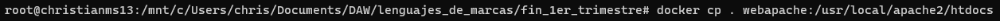
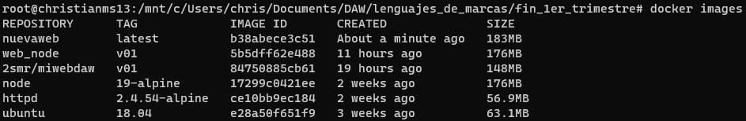

<style>
  h1{
    border: none;
    margin-bottom: 2px;
    text-align: center;
    font-weight: bold;
  }

  img{
    border: 2px solid black;
  }

  <p{
    text-align: justify;
  }>
</style>

<h1>DOCKER - E2</h1>

<hr>

<p><b>1. Download and run version 2.4.54-alpine of the web server to access the Apache server via port 8080.</b></p>

```bash
docker run -d -p 8080:80 httpd:2.4.54-alpine
```


```bash
docker rename pdantic_mcclintock webapache
```


<p><b>2. Access the "webapache" terminal. Locate the default directory where the welcome file is saved. Create a directory called "backupweb" and make a copy of the default page in this directory.</b></p>

```bash
docker exec -it webapache sh
```


```bash
cd /usr/local/apache2/htdocs
```

```bash
ls -la
```


```bash
mkdir backupweb
```

```bash
cp index.html backupweb/index_copy.html
```


<p><b>3. Exit the "webapache" docker terminal. Locate a complete static project where you have your html works, styles, etc... Copy all the content of this website in the "webapache" container so that we can view the content of our website on the apache server.</b></p>

```bash
docker cp . webapache:/usr/local/apache2/htdocs
```



<p><b>4. To see if it works, stop the container and then start it again. Visit in a browser the address "localhost:8080".</b></p>


<p><b>5. Using the image pulled in exercise 1, create a new image using "Dockerfile" to create a container called "nuevaweb", which will be used as a web page, using port 8081.</b></p>

<p>Content in the "Dockerfile" file:</p>

```bash
from httpd:2.4.54-alpine
copy . /usr/local/apache2/htdocs
expose 8081
```


<p>Building the image, this time I didn't specify the version:</p>

```bash
docker build -t nuevaweb .
```


```bash
docker images
```



<p>An now creating the container from this image:</p>

```bash
docker run -d --name nuevaweb -p 8081 nuevaweb
```


<p>And now it can be visited from a web browser:</p>


<p><b>6. Modify the web page content. What do you need to do?</b></p>

<p></p>

<p><b>7. To avoid having to rebuild the container on each page source code change web, use a volume that automatically synchronizes the web directory of our host with container web directory. Use the following statement: "docker run -d -p 80:80 -v host_directory:webapache_container_directory"</b></p>


<p><b>8. Check that the previous step works. To do this, it modifies the content of the web page and test that when updating the changes are published by the server.</b></p>

