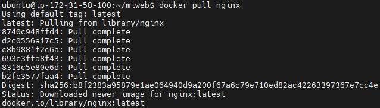
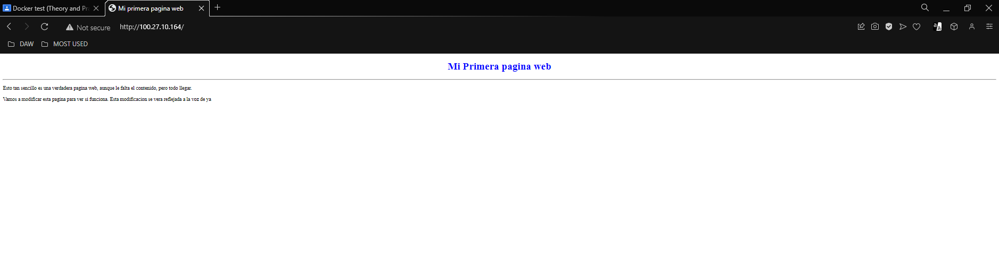
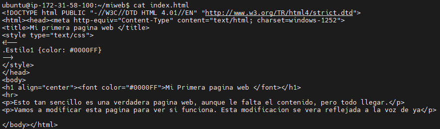
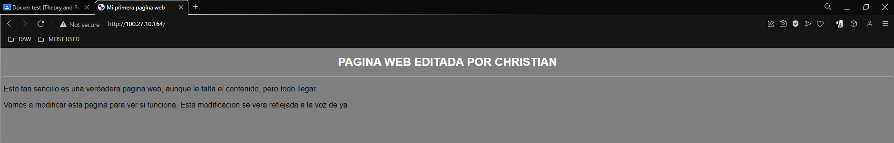
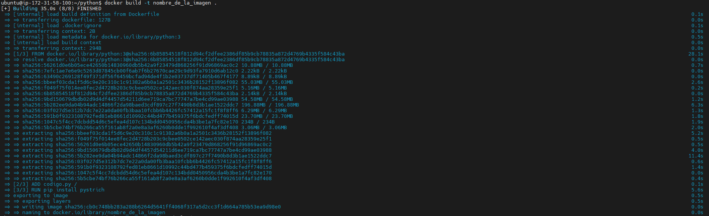
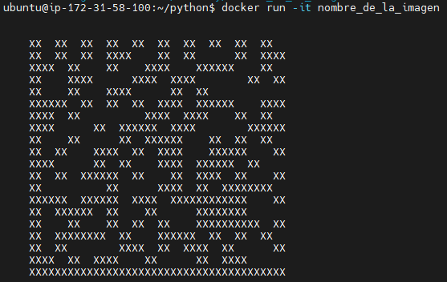
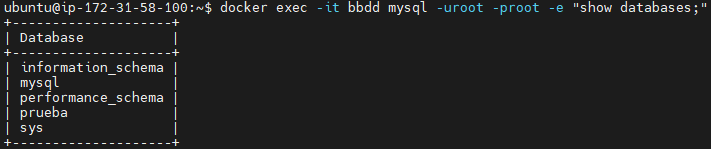

<style>
  h1{
    border: none;
    font-weight: bold;
    text-align: center;
    margin-bottom: 0px;
  }

  p{
    text-align: justify;
  }

  img{
    border: 2px solid black;
  }
</style>

<h1>EXAMEN CHRISTIAN MILLÁN SORIA</h1>

<hr>

<p><b>1.a. ¿Es Docker lo mismo que una máquina virtual? Explica tu respuesta.</b></p>

<p>Una máquina virtual es un sistema que crea un entorno aislado en el que se ejecuta un sistema operativo completo y sus aplicaciones, como si estuvieran en un ordenador separado. Esto permite ejecutar aplicaciones en diferentes sistemas operativos y entornos de manera aislada y segura.</p>

<p>Por otro lado, Docker utiliza los llamados "contenedores". En lugar de crear un sistema operativo completo y aislado, los contenedores de Docker aislan solo la aplicación y sus dependencias. Esto hace que los contenedores sean más ligeros y más rápidos que las máquinas virtuales, a costa de un menor nivel de aislamiento.</p>

<p><b>1.b. ¿Qué es una imagen Docker?</b></p>

<p>Una imagen Docker es un archivo que contiene todo lo necesario para ejecutar una aplicación en un contenedor Docker. Incluye el código de la aplicación, las bibliotecas, los archivos de configuración y todo lo necesario para que la aplicación funcione de manera independiente en un contenedor Docker.</p>

<p>Las imágenes Docker son el núcleo de Docker y se utilizan para crear y ejecutar contenedores. Al crear un contenedor, Docker descarga la imagen y la usa como base para crear una instancia única y aislada del contenedor.</p>

<p><b>2.a. ¿Qué es Docker Hub?</b></p>

<p>Docker Hub es un servicio en la nube de Docker que permite a los desarrolladores compartir y descargar imágenes Docker. Es un repositorio público de imágenes Docker que se pueden utilizar para crear contenedores en cualquier máquina que tenga Docker instalado.</p>

<p>Docker Hub permite a los desarrolladores publicar y compartir sus imágenes con la comunidad, lo que facilita la colaboración y la reutilización de código.</p>

<p>En resumen, Docker Hub es una plataforma centralizada para la gestión y el intercambio de imágenes Docker, que permite a los desarrolladores colaborar y compartir imágenes de manera sencilla y eficiente.</p>

<p><b>2.b. ¿Qué son los contenedores?</b></p>

<p>Los contenedores de Docker son una forma de empaquetar y distribuir aplicaciones y sus dependencias.</p>

<p>Los contenedores de Docker son muy útiles porque permiten a los desarrolladores empaquetar y distribuir aplicaciones de manera consistente y segura. Esto significa que los desarrolladores pueden estar seguros de que la aplicación funcionará de la misma manera en cualquier máquina que tenga Docker instalado, como hemos podido ver en clase.</p>

<p><b>3. Describe qué hacen los siguientes comandos:</b></p>

<p>a.</p>

```bash
docker image pull debian:bullseye
```

<p>Este comando descarga una imagen del sistema operativo "Debian" de Docker Hub. Además especifica que la versión a descargar de la imagen es la "bullseye".</p>

<p><b>b.</b></p>

```bash
docker image ls | grep Ubuntu
```

<p>Este comando muestra todas las imágenes relacionadas con Ubuntu (las filtra con el "grep"), es decir, todas las imágenes cuyo nombre o versión correspondan a Ubuntu.</p>

<p><b>c.</b></p>

```bash
docker run --name Debian -d -it debian:bullseye
```

<p>Este comando crea un nuevo contenedor Docker con una serie de parámetros:</p>

<li>"--name Debian": establece un nombre para el contenedor, en este caso el nombre es "Debian"</li>
<li>"-d": Devuelve el terminal al usuario, es decir, el contenedor se ejecuta en segundo plano y no se queda a la espera de mostrar logs ni nada por el estilo, sino que permite que el usuario pueda seguir utilizando el mismo terminal</li>
<li>"-it": establece que lo que quiere el usuario es ejecutar el contenedor de forma interactiva, es decir, poder utilizar el terminal de comandos del contenedor una vez este se inicie</li>

<p>Por último, el "debian:bullseye" establece la imagen Docker que se va a utilizar para crear dicho contenedor.</p>

<p><b>d.</b></p>

```bash
docker exec –it Debian bash
```

<p>Este comando permite conectar/dejar utilizar el contenedor al usuario, es decir, con el "exec" declara esto mismo, con el "-it" establece que será de forma interactiva (para poder utilizar su termina de comandos), "Debian" es el nombre del contenedor y el "bash" es el shell con el que se quiere utilizar este contenedor.</p>

<p><b>e.</b></p>

```bash
docker stop ac ab fg && docker rm ac ab fg
```

<p>Esta línea ejecuta dos comandos diferentes:</p>

<li>El primero para los contenedores cuyos tokens/IDs empiezan por "ac", "ab" y "fg"</li>
<li>El segundo, separado del primero por "&&", elimina los contenedores cuyos tokens/IDs empiezan por "ac", "ab" y "fg", es decir, los contenedores que ya han sido parados por el comando anterior, ya que para eliminar un contenedor es necesario pararlo primero</li>

<p><b>f.</b></p>

```bash
docker build –t mi_propia_imagen:v01 .
```

<p>El comando "docker build -t mi_propia_imagen:v01 ." crea una nueva imagen de Docker a partir de un archivo Dockerfile en el directorio actual:</p>

<li>"docker build" es el comando para construir una nueva imagen de Docker</li>

<li>"-t mi_propia_imagen:v01" le da a la imagen el nombre y la etiqueta "mi_propia_imagen:v01"</li>

<li>El punto "." al final del comando indica el contexto de construcción, es decir, el directorio en el que se encuentra el archivo Dockerfile</li>

<li>El archivo Dockerfile contiene las instrucciones para construir la imagen de Docker. La imagen resultante incluirá todos los recursos y configuraciones especificadas en el Dockerfile</li>

<p><b>g.</b></p>

```bash
docker login -u2smr && docker search mariadb
```

<p>El comando "docker login -u2smr && docker search mariadb" inicia sesión en un registro de Docker y busca una imagen en el registro.</p>

<li>"docker login -u2smr" inicia sesión en un registro de Docker con el nombre de usuario "2smr"</li>

<li>"docker search mariadb" busca una imagen en el registro de Docker que tenga "mariadb" en su nombre o etiqueta</li>

<li>El operador "&&" indica que los comandos "docker login" y "docker search" deben ejecutarse uno después del otro y que el segundo solo se ejecutará si el primero se completa correctamente. Esto significa que primero se iniciará sesión en el registro de Docker y luego se buscará la imagen</li>

<p><b>h.</b></p>

```bash
docker tag mi_propia_imagen:v01 2smr/miweb:v01
```

<p>El comando "docker tag mi_propia_imagen:v01 2smr/miweb:v01" etiqueta una imagen de Docker con un nuevo nombre y etiqueta.</p>

<li>*"docker tag" es el comando para etiquetar una imagen de Docker**</li>

<li>"mi_propia_imagen:v01" es el nombre y la etiqueta actual de la imagen</li>

<li>"2smr/miweb:v01" es el nuevo nombre y la etiqueta para la imagen. El nombre incluye el prefijo de usuario "2smr" y la etiqueta "v01"</li>

<p>Esta operación de etiquetado permite referenciar la imagen con un nombre y etiqueta diferentes y puede ser útil, por ejemplo, para compartir la imagen con otros usuarios o publicarla en un registro de Docker</p>

<p><b>i.</b></p>

```bash
docker push 2smr/miweb:v01
```

<p>El comando "docker push 2smr/miweb:v01" envía una imagen de Docker a un registro de Docker.</p>

<li>"docker push" es el comando para enviar una imagen de Docker a un registro de Docker</li>

<li>"2smr/miweb:v01" es el nombre y la etiqueta de la imagen que se va a enviar. Incluye el prefijo de usuario "2smr" y la etiqueta "v01"</li>

<hr>

<p><b>4. Usa el contenido de la carpeta "~/miweb" para montar un contenedor servidor web (puerto 80). Condición: si se cambia el código del fichero "index.html", estos cambios se reflejarán automáticamente al refrescar el navegador.</b></p>

<p>Lo primero es descargar la imagen de Nginx para poder crear el contenedor servidor web:</p>

```bash
docker pull nginx
```



<p>Lo siguiente es crear el contenedor y establecer la carpeta con el contenido en el directorio predeterminado de Nginx para páginas web.</p>

```bash
docker run -d -p 80:80 -v ~/miweb:/usr/share/nginx/html nginx
```

<p>Y ahora se puede visitar en un navegador para ver la página web.</p>



<p>De forma predeterminada, en el "index.html", hay un "h1" que dice "Mi Primera pagina web".</p>



<p>Para comprobar que si se hace un cambio en el archivo "index.html" se cambia el contenido de la página, utilizo el comando "nano" y edito el mismo. Así es como se ve la página después de mi cambio:</p>

```bash
nano index.html
```



<p><b>5.a. Crea una imagen usando el fichero Dockerfile del directorio "python" y ejecuta dicha imagen devolviendo el control en la consola de comandos.</b></p>

<p>Me sitúo en el directorio "python" y compruebo que el contenido del Dockerfile es correcto. Una vez he hecho esto ejecuto el siguiente comando:</p>

```bash
docker build -t nombre_de_la_imagen .
```



<p>Y por último creo un contenedor nuevo utilizando esta imagen recién generada. El contenedor muestra por pantalla un código QR generado por el archivo "codigo.py".</p>

```bash
docker run -it nombre_de_la_imagen
```



<p><b>5.b. Crea una base de datos basada en mariadb:latest.</b></p>

<p>Primero creo un directorio en el home para trabajar en él:</p>

```bash
mkdir mariadb-data
```

<p>Desde fuera de él, ejecuto el siguiente comando de Docker para crear el contenedor con todas las variables de entorno necesarias para cumplir los apartados del examen:</p>

```bash
docker run --name bbdd -p 3336:3306 -e MARIADB_ROOT_PASSWORD=root -e MARIADB_DATABASE=prueba -e MARIADB_USER=invitado -e MARIADB_PASSWORD=invitado -v $PWD/mariadb-data:/var/lib/mysql -d mariadb:latest
```

<p>Me conecto al contenedor y dentro de él ejecuto el comando "show databases;". Esto se puede hacer todo en una misma línea de comando con el argumento "-e":</p>

```bash
docker exec -it bbdd mysql -uroot -proot -e "show databases;"
```

