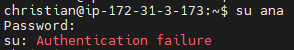
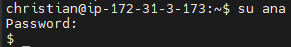
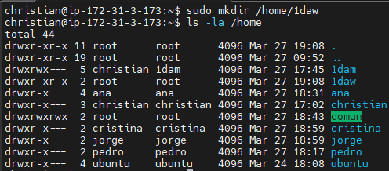

<style>
  h1{
    text-align: center;
    font-weight: bold;
    border: none;
    margin-bottom: 0px;
  }

  p{
    text-align: justify;
  }

  img{
    border: 2px solid black;
  }

  #ex{
    border: none;
  }
</style>

<h1>EXAMEN CHRISTIAN MILLÁN SORIA</h1>

<hr>

<p><b>COMANDOS DE LINUX</b></p>

<p><b>Para puntuar tu respuesta tienes que realizar captura de pantalla con los comandos usados.</b></p>

<p><b>1. Ejecuta instrucciones simples que den como resultado la respuesta a las siguientes cuestiones:</b></p>

<li>Fecha y hora del sistema</li>

```bash
date
```


<li>Directorio donde te encuentras</li>

```bash
pwd
```


<li>Ir directamente al directorio de trabajo del usuario</li>

```bash
cd
```

También funciona el siguiente:

```bash
cd ~
```


<li>Listar de manera que veamos los permisos de usuario, grupo y otros del directorio home del sistema</li>

```bash
ls -l /home
```


<li>Saber el nombre del usuario con el que nos hemos conectado</li>

```bash
whoami
```


<li>Saber el nombre que tiene el servidor</li>

```bash
hostname
```


<p><b>2. En "<code>/home/1dam</code>":</b></p>

<li>Crea, usando una única instrucción, el siguiente directorio:</li>


<p>Respuesta:</p>

```bash
sudo mkdir -p /home/1dam/{1trim/{documentos,hardware,recursos,videos},2trim/{comandos_linux,recursos},3trim/{recursos,redes}}
```


<p>Instalo "tree" para poder ver el árbol de directorios y esta es la estructura resultante:</p>


<li>Crea, desde tu workdir, dos ficheros de texto vacíos como los siguientes:</li>


<p>Respuesta:</p>

```bash
sudo touch /home/1dam/1trim/hardware/placasbase.txt && sudo touch /home/1dam/1trim/hardware/procesadores.txt
```


<li>Realiza una copia de los mismos a "<code>3trim/recursos</code>..." (con una única instrucción).</li>


<p>Respuesta:</p>

```bash
sudo cp -r /home/1dam/1trim/hardware/. /home/1dam/3trim/recursos/.
```


<p><b>3. Crea los usuarios "ana" y "pedro". Crea también el usuario "alonso" de manera que su workdir sea "<code>/home/alonsopersonal</code>". El shell de este usuario será "<code>/bin/bash</code>". Créale una contraseña de acceso.</b></p>

<p>Los dos primeros usuarios:</p>

```bash
sudo useradd -m ana
```

```bash
sudo useradd -m pedro
```


<p>Ahora el usuario "alonso":</p>

```bash
sudo useradd -m -d /home/alonsopersonal -s /bin/bash alonso
```


<p>Y le establezco una contraseña de acceso:</p>

```bash
sudo passwd alonso
```


<p>*La contraseña es "1234".</p>

<p><b>4. Realiza un listado en pantalla donde se vean a todos los usuarios creados.</b></p>

<p>Para ver todos los usuarios creados del sistema se utiliza el siguiente comando:</p>

```bash
cat /etc/passwd
```


<p>Si lo que pretende este ejercicio es mostrar solo lso usuarios creados en el ejercicio anterior, utilizo el siguiente comando:</p>

```bash
tail -3 /etc/passwd
```


<p><b>5. Cambia de tu usuario actual al usuario "ana" y crea, usando la instrucción "<code>mkdir</code>", un directorio dentro de su directorio de trabajo llamado "documentos".</b></p>

<p>Primero establezco una contraseña para el usuario "ana" para poder acceder a él:</p>

```bash
sudo passwd ana
```


<p>*La contraseña es "1234".</p>

<p>Ahora cambio al usuario "ana":</p>

```bash
su ana
```


<p>Debido a que el shell de "ana" y "pedro" no se establecieron, de forma automática se les ha puesto "<code>/bin/sh</code>".</p>

<p>Por último, creo el directorio "documentos" dentro de su directorio de trabajo.</p>

```bash
mkdir ~/documentos
```


<p>Ahora me dirijo al workdir de "ana" para comprobar que el directorio se ha creado.</p>


<p><b>6. Como usuario "ana", trata de acceder al workdir de "alonso". ¿Qué ocurre? ¿Por qué?</b></p>

```bash
cd /home/alonso
```


<p>El usuario "ana" no puede acceder al directorio personal de "alonso" ya que no es su propio directorio personal y tampoco es un superusuario o un usuario con los permisos necesarios para ello.</p>

<p>Debido a que el shell de "ana" es "<code>/bin/sh</code>" no aparece un prompt tan elaborado como en "<code>/bin/bash</code>" y el error que ocurre no se especifica demasiado.</p>

<p><b>7. Crea un fichero llamado "infopersonal.txt" dentro de la carpeta "documentos" del usuario "ana". Introduce nombre, apellidos, dirección y cualquier otro contenido que inventes. Guarda el fichero y visualízalo por pantalla.</b></p>

<p>Primero creo el fichero con el siguiente comando y le inserto el contenido pedido:</p>

```bash
nano documentos/infopersonal.txt
```


<p>El contenido:</p>


<p>Lo visualizo por pantalla con el siguiente comando:</p>

```bash
cat documentos/inforpersonal.txt
```


<p><b>8. Bloquea al usuario "ana". Prueba que su bloqueo es efectivo.</b></p>

```bash
sudo passwd -l ana
```


<p>Comprobación de que el usuario "ana" ya no es accesible:</p>



<p><b>9. Borra el usuario "alonso" de manera que al ejecutar la instrucción de eliminación se borre también su workdir "<code>/home/alonsopersonal</code>". Desbloquea al usuario "ana.</b></p>

<p>Para eliminar al usuario "alonso" junto con su workdir, utilizo el siguiente comando:</p>

```bash
sudo deluser --remove-home alonso
```


<p>Desbloqueo del usuario "ana":</p>

```bash
sudo passwd -u ana
```


<p>Comprobación del desbloqueo:</p>

```bash
su ana
```



<p><b>10. Crea una carpetas en "<code>/home</code>" llamada "comun". Ejecuta los comandos necesarios para que todos los usuarios del sistema puedan acceder a ella con todos los permisos (rwx).</b></p>

```bash
sudo mkdir /home/comun
```


<p>Cambio de permisos:</p>

```bash
sudo chmod 777 /home/comun
```


<p><b>11. Crea dos nuevos grupos en el sistema denominados "1daw" y "1dam". Introduce a tu usuario en el grupo al que pertenezcas. Introduce a los usuarios "ana" y "pedro" en el grupo "1daw". Crea dos usuarios nuevos "jorge" y "cristina" y agrégalos al grupo "1dam".</b></p>

<p>Primero creo los dos grupos.</p>

```bash
sudo groupadd 1daw && sudo groupadd 1dam
```


<p>Ahora introduzco a mi usuario en el grupo "1daw", que es al que yo pertenezco.</p>

```bash
sudo adduser christian 1daw
```


<p>Añado a los usuarios "ana" y "pedro" al grupo "1daw".</p>

```bash
sudo adduser ana 1daw && sudo adduser pedro 1daw
```


<p>Y por último, creo los usuarios "jorge" y "cristina" y los agrego al grupo "1dam".</p>

```bash
sudo useradd -m jorge
```

```bash
sudo useradd -m cristina
```


<p>Para añadirlos al grupo...</p>

```bash
sudo adduser jorge 1dam && sudo adduser cristina 1dam
```


<p><b>12. Realiza un listado de los grupos creados y sus componentes.</b></p>

<p>Para ver los dos grupos creados anteriormente utilizo el siguiente comando:</p>

```bash
tail -6 /etc/group
```


<p>*El 6 es para poder ver los dos primeros usuarios, los dos grupos con sus componentes y los dos últimos usuarios.</p>

<p><b>13. Haz lo necesario para que el directorio "<code>/home/1dam</code>" creado en el ejercicio 2 sea accesible con todos los permisos para los componentes del grupo "1dam" y no para el resto de usuarios.</b></p>

<p>Primero cambio el usuario y el grupo propietario de dicho directorio y con el siguiente comando le cambio los permisos para que estos puedan acceder a él con todos los permisos y los demás no tengan ningún permiso sobre él:</p>

```bash
sudo chown christian:1dam /home/1dam
```

```bash
sudo chmod 770 /home/1dam
```


<p><b>14. Crea una copia de toda la estructura de directorios y archivos desde "<code>/home/1dam</code>" a "<code>/home/1daw</code>". Haz lo necesario para que solo los salumnos de "1daw" puedan acceder a dicho directorio.</b></p>

<p>Primero creo el directorio "1daw".</p>

```bash
sudo mkdir /home/1daw
```



<p>Copio todo el contenido con el siguiente comando</p>

```bash
sudo cp -r /home/1dam/. /home/1daw/
```


<p>Lo siguiente es cambiar los permisos y el usuario y grupo propietarios para que solo puedan acceder los alumnos de "1daw":</p>

```bash
sudo chmod 770 /home/1daw
```

```bash
sudo chown ana:1daw /home/1daw
```

<p>*He utilizado el usuario "ana" porque es una de las alumnas de "1daw".</p>


<p>Como se puede ver, el usuario "ana" sí puede acceder al directorio "<code>/home/1daw</code>", debido a que está en el grupo "1daw".</p>

```bash
cd /home/1daw
```


<p>Sin embargo, el usuario "cristina" no puede acceder a este directorio porque no pertenece a este grupo.</p>

```bash
cd /home/1daw
```


<p>*La contraseña que le he puesto a este usuario es "1234".</p>