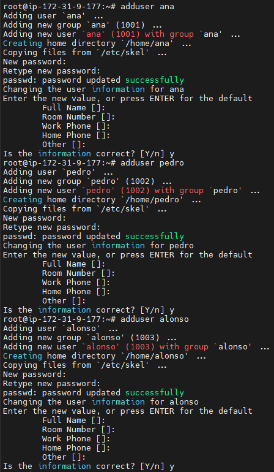
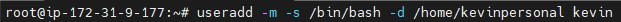
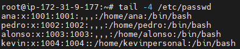
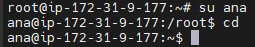
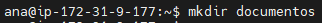
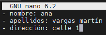
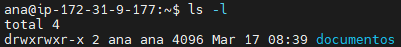

<style>
  h1{
    text-align: center;
    font-weight: bold;
    border: none;
    margin-bottom: 0px;
  }

  p{
    text-align: justify;
  }

  img{
    border: 2px solid black;
  }

  #ex{
    border: none;
  }
</style>

<h1>GESTIÓN DE USUARIO</h1>

<hr>

<p><b>1. Accede un terminal de Ubuntu y crea los usuarios "ana", "pedro" y "alonso" usando el comando "<code>adduser</code>".</b></p>

```bash
adduser < username >
```



<p><b>2. Crea otro usuario llamado "kevin" usando esta vez la instrucción "<code>useradd</code>", de manera que su workdir sea "/home/kevinpersonal". El shell de este usuario será "/bin/bash". Créale una contraseña de acceso.</b></p>

```bash
useradd -m -s /bin/bash -d /home/kevinpersonal kevin
```



<p><b>3. Lista las 4 últimas líneas del fichero "/etc/passwd". ¿Qué información estás viendo como resultado de este listado?</b></p>

```bash
tail -4 /etc/passwd
```


<p>Al listar estas líneas, se puede ver información sobre los últimos 4 usuarios del sistema, incluyendo sus nombres de usuario, UID, GID, descripciones y ubicaciones de los directorios de inicio. Esto se debe a que el archivo "/etc/passwd" es un archivo de texto que contiene información sobre los usuarios del sistema.</p>

<p><b>4. Cambia de tu usuario al usuario "ana" y crea, usando la instruccion "<code>mkdir</code>", un directorio dentro de su directorio de trabajo llamado "documentos".</b></p>

```bash
# cambio de usuario
  su ana
```



```bash
# creación del directorio
  mkdir documentos
```



<p><b>5. Trata de acceder al workdir de "alonso". ¿Qué ocurre? ¿Por qué?</b></p>

```bash
cd ../alonso/
```


<p>El usuario "ana" no tiene permisos para entrar a dicho directorio, ya que el workdir de cada usuario solo puede ser utilizado por el propio usuario o por "root".</p>

<p><b>6. Con el comando "<code>nano</code>", crea un fichero llamado "infopersonal.txt" dentro de la carpeta "documentos" creada en el ejercicio 4. Introduce el nombre, apellidos, dirección y cualquier otro contenido que inventes. Guarda el fichero con "<code>CTRL+X</code>".</b></p>

```bash
nano documentos/infopersonal.txt
```



<p><b>7. Realiza un listado del contenido del workdir de "ana" con la instrucción "<code>ls -l</code>". Describe la información que ves.</b></p>

```bash
ls -l
```



<p></p>