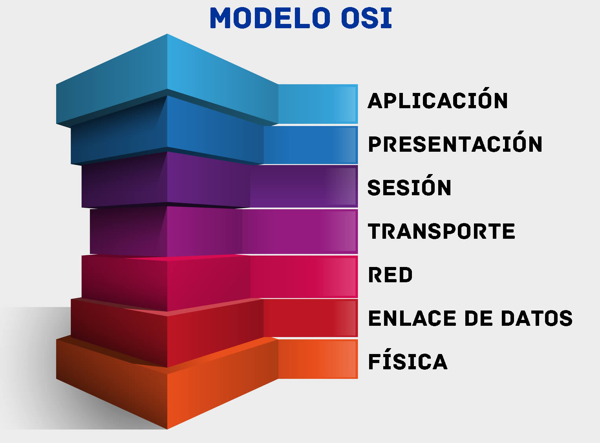
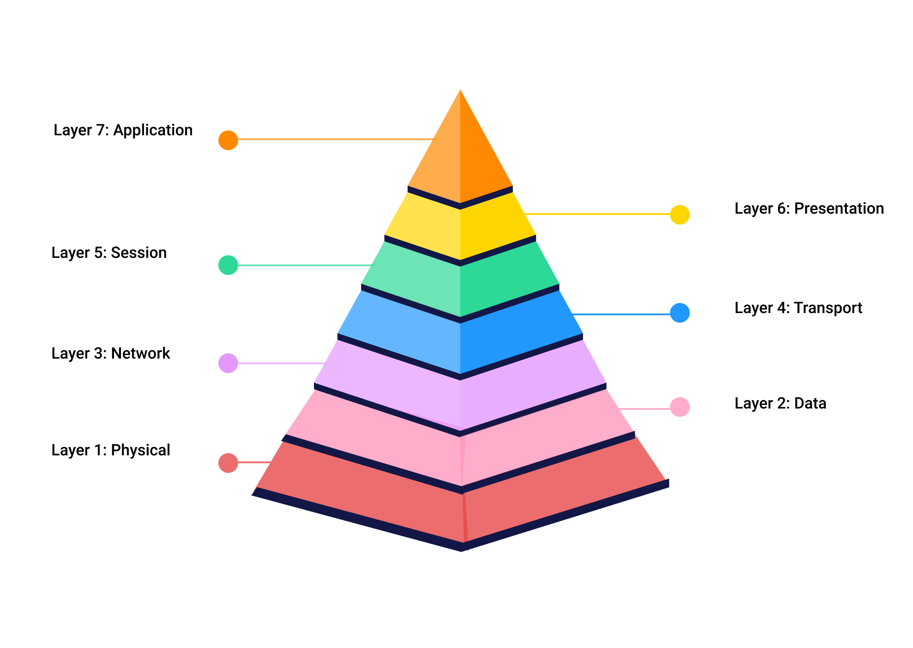
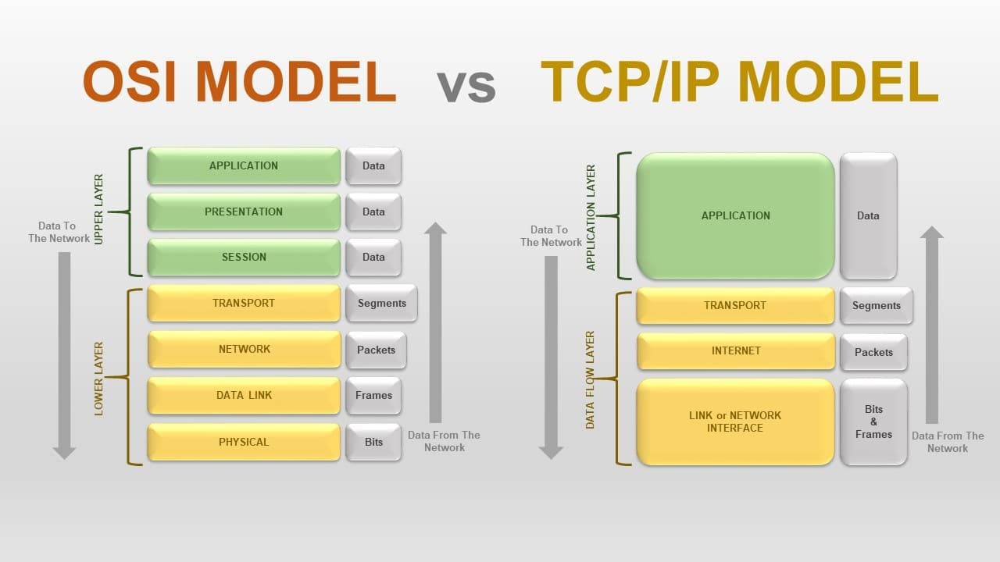

<h1>TASK 1 - THE OSI AND TCP/IP MODELS</h1>

<h4>CHRISTIAN MILLÁN SORIA</h4>

<h2>OSI MODEL</h2>

<b>1. ¿Qué es el modelo OSI? Cuenta algo de su historia. ¿Cuándo fue introducido?</b>

El modelo OSI (Open Systems Interconnection) es un modelo de referencia para la comunicación entre dispositivos de una red de ordenadores.

Fue desarrollado por la Organización Internacional de Normalización (ISO) en 1984.

Es un marco conceptual que describe cómo los datos viajan a través de una red.

<b>2. Gráfico con las 7 capas del modelo OSI, dando una breve explicación de cada una.</b>

<li>Capa física: Se encarga de la transmisión de bits a través de un medio de comunicación físico. Ejemplos de protocolos: USB, HDMI.</li>

<li>Capa de enlace de datos: Asegura que los datos sean entregados sin errores y en orden a través de la red. Ejemplos de protocolos: Ethernet, Wi-Fi.</li>

<li>Capa de red: Encargada de enrutar los paquetes de datos a través de la red y de tomar decisiones sobre la mejor ruta para enviarlos. Ejemplos de protocolos: IP, ICMP.</li>

<li>Capa de transporte: establece y mantiene conexiones extremo a extremo entre dispositivos y proporciona un control de flujo confiable. Ejemplos de protocolos: TCP, UDP.</li>

<li>Capa de sesión: establece, mantiene y finaliza sesiones entre dispositivos. Ejemplos de protocolos: NetBIOS, RPC.</li>

<li>Capa de presentación: se encarga de la representación y conversión de datos para que puedan ser interpretados por las aplicaciones que los utilizan. Ejemplos de protocolos: TLS, SSL.</li>

<li>Capa de aplicación: es la capa más cercana a la interfaz de usuario y proporciona servicios de red a las aplicaciones. Ejemplos de protocolos: HTTP, FTP, SMTP.</li>

<b>3. Ventajas del modelo OSI.</b>

El modelo OSI es beneficioso porque proporciona una forma estándar de comunicación entre dispositivos de diferentes fabricantes y sistemas operativos. También facilita la detección y solución de problemas de red, ya que cada capa tiene su propio conjunto de protocolos y funciones bien definidos. Además, el modelo OSI permite a los desarrolladores de software crear soluciones de red específicas para cada capa.

<b>4. Explica en no más de 4 párrafos, información sobre cada una de las capas OSI. Incluye una imagen relacionada con ello y di cuál es el nombre de la PDU en cada una de las capas.</b>

<li>Capa física: Esta capa se encarga de la transmisión de datos a través del medio físico. La PDU en esta capa se llama "Bit".</li>

<li>Capa de enlace de datos: Esta capa es responsable de la transferencia de datos entre dispositivos en una misma red física. Aquí es donde se asegura que los datos sean entregados sin errores y en el orden correcto. La PDU en esta capa se llama "Trama".</li>

<li>Capa de red: Esta capa se encarga de la dirección y enrutamiento de paquetes a través de la red. La PDU en esta capa se llama "Paquete".</li>

<li>Capa de transporte: Esta capa se encarga de la entrega de datos de extremo a extremo. Aquí es donde se asegura que los datos sean entregados sin errores y en el orden correcto. La PDU en esta capa se llama "Segmento".</li>

<li>Capa de sesión: Esta capa establece, mantiene y finaliza las sesiones entre dos dispositivos. La PDU en esta capa se llama "Datos".</li>

<li>Capa de presentación: Esta capa se encarga de la representación de datos y de asegurar que la información sea entendible por ambos extremos. La PDU en esta capa se llama "Datos".</li>

<li>Capa de aplicación: Esta capa es responsable de proporcionar servicios de red al usuario final. Aquí es donde ocurre la comunicación entre el usuario y la red. La PDU en esta capa se llama "Mensaje".</li>

<b>5. Busca un video explicativo de las capas OSI.</b>

<a href="https://www.youtube.com/watch?v=vv4y_uOneC0">Este</a> es el vídeo.

<h2>TCP/IP</h2>

<b>1. ¿Qué es el modelo TCP/IP? Incluye algo sobre la historia del TCP/IP. ¿Cuándo se introdujo?</b>

El modelo TCP/IP es un modelo de referencia utilizado para describir cómo las redes de computadoras se comunican entre sí. Fue desarrollado por el Departamento de Defensa de los Estados Unidos en la década de 1970 para estandarizar la comunicación en redes de computadoras y permitir la interoperabilidad entre dispositivos de diferentes fabricantes. Fue introducido en la década de 1980.

<b>2. Gráfica donde se puedan ver las capas de OSI vs TCP/IP.</b>

<b>3. ¿Qué es un protocolo? Explica en algunas líneas los siguientes protocolos comúnmente utilizados en TCP/IP. Colócalos en la capa correcta donde presta servicio.</b>

<li><b>Ethernet (IEEE 802.3):</b> Protocolo utilizado en la capa de enlace de datos para permitir la comunicación entre dispositivos conectados a la misma red física.</li>

<li><b>UDP (User Datagram Protocol):</b> Protocolo de transporte que se utiliza para enviar paquetes de datos a través de una red sin la garantía de entrega confiable. Es utilizado en aplicaciones donde la velocidad es más importante que la fiabilidad, como en la transmisión de video en vivo.</li>

<li><b>NFS (Network File System):</b> Protocolo de aplicación que permite a un sistema operativo cliente acceder y compartir archivos en un sistema de archivos remoto en una red.</li>

<li><b>TCP (Transmission Control Protocol):</b> Protocolo de transporte que proporciona una conexión confiable entre dos dispositivos de red. Garantiza que los datos se entreguen en el orden correcto y sin errores.</li>

<li><b>ARP (Address Resolution Protocol):</b> Protocolo de Internet utilizado para mapear una dirección IP a una dirección MAC en la capa de enlace de datos.</li>

<li><b></b></li>