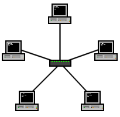
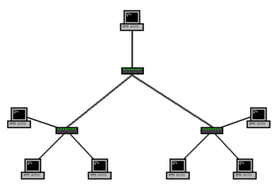

<h1>TASK 2 - THE PHYSICAL LAYER</h1>

<h4>CHRISTIAN MILLÁN SORIA</h4>

<b>1. ¿Qué es una topología de red? Describe y utiliza imágenes para explicar la red en estrella y la red en árbol.</b>

Una topología de red se refiere a la estructura física o lógica de una red informática.

<h3>RED EN ESTRELLA</h3>

En la red en estrella, todos los dispositivos están conectados al nodo central (switch) a través de un cable. Este nodo central es responsable de dirigir el tráfico de la red y actúa como un punto de control para la comunicación entre los dispositivos. Si un dispositivo desea comunicarse con otro dispositivo, envía los datos al nodo central, que luego los retransmite al dispositivo de destino.

<h3>RED EN ÁRBOL</h3>

En la red en árbol, los dispositivos se organizan en varias ramas que se extienden desde un nodo raíz. Los dispositivos se conectan a través de enlaces de red en una estructura jerárquica. Los dispositivos en los niveles superiores de la jerarquía actúan como concentradores para los dispositivos en los niveles inferiores. Si un dispositivo desea comunicarse con otro dispositivo, los datos se transmiten a través de los enlaces de red y los concentradores de nivel superior hasta que llegan al dispositivo de destino.

*Es importante destacar que cada tipo de topología tiene sus propias ventajas y desventajas en términos de escalabilidad, confiabilidad y complejidad de la red.

<b>2. </b>
