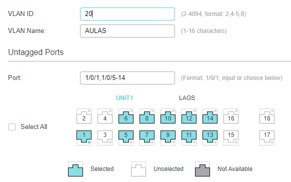

<h1>TASK 3 - WORKING WITH SMART SWITCHES AND MANAGED SWITCHES</h1>

<h4>CHRISTIAN MILLÁN SORIA</h4>

<h3>VLANS</h3>

Una VLAN (Virtual Local Area Network) es una red lógica que se crea al segmentar un conjunto de dispositivos en una red física en subgrupos lógicos aislados. Esto permite que los dispositivos en una misma VLAN se comuniquen entre sí como si estuvieran conectados directamente en una misma red local, aunque en realidad pueden estar físicamente separados en diferentes ubicaciones. Las VLAN se utilizan para mejorar la eficiencia y seguridad de la red, permitiendo la agrupación de dispositivos en función de su función o ubicación, lo que facilita la gestión de la red, aumenta la seguridad y permite una mejor asignación de recursos de red.

<h3>SWITCHES</h3>

Un switch es un dispositivo de red que se utiliza para interconectar diferentes dispositivos en una red local, permitiendo que estos se comuniquen entre sí. Los switches operan en la capa de enlace de datos del modelo OSI y utilizan la dirección MAC (Media Access Control) de los dispositivos para enrutar los paquetes de datos hacia su destino correcto. Los switches pueden ser configurados para crear VLANs y controlar el flujo de tráfico de red, lo que permite una mejor gestión y seguridad de la red. Los switches se utilizan comúnmente en redes empresariales, escolares y domésticas para interconectar dispositivos como computadoras, impresoras, teléfonos IP y dispositivos de almacenamiento en red.

<h3>PRÁCTICA</h3>

Vamos a trabajar con <a href="https://www.tp-link.com/us/support/emulator/">TP-Link Emulator</a>.

Primero entramos en el enlace. Acto seguido nos dirigimos al apartado de la lista de switches de empresa y smart switches.

Al hacer clic en el desplegable, seleccionamos el modelo "<a href="https://emulator.tp-link.com/T1600G-18TS(UN)_2.0_Emulator/index.html">T1600G-18TS</a>".

Lo primero en esta nueva pestaña es seleccionar la capa 2 de red.

Y dentro de aquí clicamos en la opción "VLAN" del menú lateral izquierdo. Esto nos lleva al sub-apartado de 802.1Q VLAN automáticamente

Una vez en este menú, podemos ver una lista de las VLANs correspondientes al switch con el que estamos trabajando.

Hacemos clic en el botón para añadir una nueva VLAN arriba a la derecha.

Nos encontramos con un menú de creación. Primero establecemos el ID de la nueva VLAN y un nombre (puede ser un departamento al que estará dedicada, por ejemplo).

Seleccionamos los puertos del switch que pertenecerán a esta VLAN y le damos al botón "CREAR".

Hacemos lo mismo para la VLAN dedicada a todas las aulas del centro.

Pasamos a la pestaña de configuración de puertos.

Seleccionamos los puertos de la lista que pertenecen a la VLAN de administración y les asignamos la ID de la VLAN correspondiente.

Hacemos lo mismo con los demás puertos, pero esta vez para la VLAN de las aulas.

Con esto hemos establecido unas vías internas en el switch que llevarán el tráfico interno por una VLAN u otra, no permitiendo el acceso de equipos de alumnos a equipos de administración, por ejemplo.
