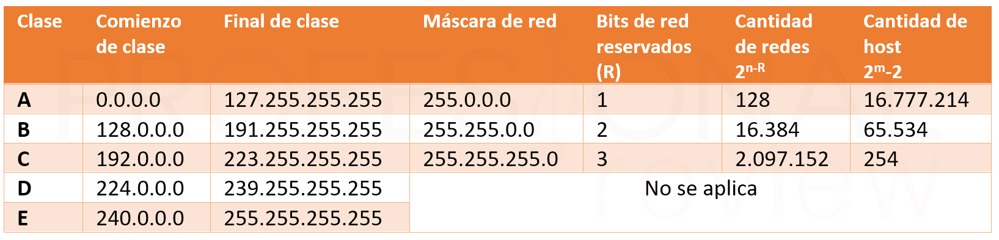

<style>
  h1, h2, h3, h4, h5, h6{
    text-align: center;
    font-weight: bold;
    border: none;
    margin-bottom: 0px;
  }

  p{
    text-align: justify;
  }

  img{
    border: 2px solid black;
  }
</style>

<h1>TASK 4 - IPV4 ADDRESSING EXERCISES</h1>

<h4>CHRISTIAN MILLÁN SORIA</h4>

<h4>1º DAW TARDE</h4>

<hr>

<p><b>1. Enumera las clases de direcciones IPv4 existentes. Describe el rango del primer byte para cada una de ellas.</b></p>


<p>Hay 5 clases de direcciones IPv4:</p>

<li>Clase A: El primer byte de una dirección de Clase A está en el rango de 1 a 126. Los primeros bits (el primer bit es siempre 0) representan el número de red y los últimos tres bytes representan el número de host.</li>

<br>

<li>Clase B: El primer byte de una dirección de Clase B está en el rango de 128 a 191. Los primeros dos bytes representan el número de red y los últimos dos bytes representan el número de host.</li>

<br>

<li>Clase C: El primer byte de una dirección de Clase C está en el rango de 192 a 223. Los primeros tres bytes representan el número de red y el último byte representa el número de host.</li>

<br>

<li>Clase D: El primer byte de una dirección de Clase D está en el rango de 224 a 239. Las direcciones de Clase D se utilizan para multicast.</li>

<br>

<li>Clase E: El primer byte de una dirección de Clase E está en el rango de 240 a 255. Las direcciones de Clase E se reservan para uso experimental y no se utilizan para la comunicación en Internet.</li>

<p>Los rangos de direcciones IPv4 son cada vez más escasos, debido al aumento constante del número de dispositivos conectados a Internet. Se está trabajando en una transición a IPv6, que utiliza direcciones más largas y ofrece un rango de direcciones mucho mayor.</p>

<p><b>2. Determina el rango de direcciones privadas existentes.</b></p>

<p>Las direcciones IP privadas son direcciones que no están asignadas a dispositivos conectados directamente a Internet, sino que se utilizan en redes privadas, como redes domésticas o de oficina. Estas direcciones se definen en el RFC 1918 de la IETF y se pueden utilizar en cualquier red local sin necesidad de registro o pago a una autoridad central. Los rangos de direcciones IP privadas son los siguientes:</p>

<li>10.0.0.0 a 10.255.255.255 (rango de Clase A)</li>

<li>172.16.0.0 a 172.31.255.255 (rango de Clase B)</li>

<li>192.168.0.0 a 192.168.255.255 (rango de Clase C)</li>

<p>Las direcciones IP privadas no son enrutables a través de Internet y que deben utilizarse en combinación con un enrutador NAT (traducción de direcciones de red) para permitir que los dispositivos en la red privada se comuniquen con dispositivos en Internet.</p>


<p><b>3. ¿Cuál es la máscara de subred predeterminada para cada una de las clases de IPv4?</b></p>

<p>Cada clase de direcciones IPv4 tiene una máscara de subred predeterminada, que se utiliza para determinar la parte de la dirección que corresponde a la red y la parte que corresponde al host. Las máscaras de subred se expresan en términos de bits y se pueden representar como una dirección IPv4 de 32 bits, en la que los bits de red se establecen en 1 y los bits de host se establecen en 0. Las máscaras de subred predeterminadas son las siguientes:</p>

<li>Clase A: 255.0.0.0</li>

<li>Clase B: 255.255.0.0</li>

<li>Clase C: 255.255.255.0</li>

<li>Clase D y Clase E no tienen máscaras de subred predeterminadas, ya que se utilizan para fines especiales y no para la identificación de hosts en redes.</li>

<br>



<p><b>4. Traduce a decimal el siguiente código binario (8 bits). Trata de hacerlo mentalmente:</b></p>

<li><b>10010010</b> -> 146 (se suman las potencias de 2 que corresponden a las posiciones con un 1 - 128+16+2=146)</li>

<li><b>11111111</b> -> 255 (128+64+32+16+8+4+2+1=255)</li>

<li><b>11000101</b> -> 197 (128+64+4+1=197)</li>

<li><b>11110110</b> -> 246 (128+64+32+16+4+2=246)</li>

<li><b>00010011</b> -> 19 (16+2+1=19)</li>

<li><b>10000001</b> -> 129 (128+1=129)</li>

<li><b>01111000</b> -> 120 (64+32+16+8=120)</li>

<li><b>11110000</b> -> 240 (128+64+32+16=240)</li>

<p><b>5. Identifica la clase IPv4 de las siguientes direcciones IP:</b></p>

<li><b>10.250.1.1_____</b> -> Clase A (El primer byte está en el rango de 1 a 126)</li>

<li><b>150.10.15.0_____</b> -> Clase B (El primer byte está en el rango de 128 a 191)</li>

<li><b>192.14.2.0_____</b> -> Clase C (El primer byte está en el rango de 192 a 223)</li>

<li><b>148.17.9.1_____</b> -> Clase B (El primer byte está en el rango de 128 a 191)</li>

<li><b>193.42.1.1_____</b> -> Clase C (El primer byte está en el rango de 192 a 223)</li>

<li><b>126.8.156.0_____</b> -> Clase A (El primer byte está en el rango de 1 a 126)</li>

<li><b>220.200.23.1_____</b> -> Clase C (El primer byte está en el rango de 192 a 223)</li>

<li><b>200.230.45.58_____</b> -> Clase C (El primer byte está en el rango de 192 a 223)</li>

<li><b>177.100.18.4_____</b> -> Clase B (El primer byte está en el rango de 128 a 191)</li>

<li><b>119.18.45.0_____</b> -> Clase A (El primer byte está en el rango de 1 a 126)</li>

<li><b>221.240.80.78_____</b> -> Clase C (El primer byte está en el rango de 192 a 223)</li>

<li><b>199.155.77.56_____</b> -> Clase C (El primer byte está en el rango de 192 a 223)</li>

<li><b>117.89.56.45_____</b> -> Clase A (El primer byte está en el rango de 1 a 126)</li>

<li><b>215.45.45.0_____</b> -> Clase D (Dirección multicast)</li>

<li><b>199.200.15.0_____</b> -> Clase C (El primer byte está en el rango de 192 a 223)</li>

<li><b>95.0.21.90_____</b> -> Clase A (El primer byte está en el rango de 1 a 126)</li>

<li><b>33.0.0.0_____</b> -> Clase A (El primer byte está en el rango de 1 a 126)</li>

<li><b>158.98.280.0_____</b> -> No es una dirección IP válida, ya que el valor "280" está fuera del rango de 0 a 255.</li>

<li><b>219.21.56.0_____</b> -> Clase C (El primer byte está en el rango de 192 a 223)</li>

<p><b>6. Rodea la parte de red y subraya la parte de host de las siguientes direcciones IP:</b></p>


<p>Las direcciones IP IPv4 se dividen en una parte de red y una parte de host, que se identifican mediante el uso de una máscara de subred. Para encontrar la parte de red y la parte de host, se deben conocer la máscara de subred y la dirección IP en cuestión.</p>

<p>La parte de red y la parte de host se determinan observando el valor decimal de cada octeto en la dirección IP. El rango de valores de la parte de red varía dependiendo de la clase de dirección, mientras que la parte de host varía dentro de ese rango.</p>

<p>Por ejemplo, en una dirección IP clase B, los primeros dos octetos identifican la red y los dos últimos octetos identifican el host. Por lo tanto, para la dirección IP 177.100.18.4, la parte de red es 177.100 y la parte de host es 18.4.</p>

<p>En resumen, para encontrar la parte de red y la parte de host de una dirección IP IPv4, es necesario conocer la clase de dirección IP y la máscara de subred que se está utilizando. La parte de red varía según la clase de dirección, mientras que la parte de host varía dentro de ese rango.</p>

<p>Dicho esto y teniendo en cuenta el ejercicio 5:</p>

<li><b>177.100.18.4</b></li>
<p>Parte de red: 177.100</p>
<p>Parte de host: 18.4</p>

<li><b>119.18.45.0</b></li>
<p>Parte de red: 119</p>
<p>Parte de host: 18.45.0</p>

<li><b>209.240.80.78</b></li>
<p>Parte de red: 209.240.80</p>
<p>Parte de host: 78</p>

<li><b>199.155.77.56</b></li>
<p>Parte de red: 199.155.77</p>
<p>Parte de host: 56</p>

<li><b>117.89.56.45</b></li>
<p>Parte de red: 117</p>
<p>Parte de host: 89.56.45</p>

<li><b>215.45.45.0</b></li>
<p>Parte de red: 215.45.45</p>
<p>Parte de host: 0</p>

<li><b>192.200.15.0</b></li>
<p>Parte de red: 192.200.15</p>
<p>Parte de host: 0</p>

<li><b>95.0.21.90</b></li>
<p>Parte de red: 95</p>
<p>Parte de host: 0.21.90</p>

<li><b>33.0.0.0</b></li>
<p>Parte de red: 33</p>
<p>Parte de host: 0.0.0</p>

<li><b>158.98.80.0</b></li>
<p>Parte de red: 158.98</p>
<p>Parte de host: 80.0</p>

<li><b>217.21.56.0</b></li>
<p>Parte de red: 217.21.56</p>
<p>Parte de host: 0</p>

<li><b>10.250.1.1</b></li>
<p>Parte de red: 10</p>
<p>Parte de host: 250.1.1</p>

<li><b>150.10.15.0</b></li>
<p>Parte de red: 150.10</p>
<p>Parte de host: 15.0</p>

<li><b>192.14.2.0</b></li>
<p>Parte de red: 192.14.2</p>
<p>Parte de host: 0</p>

<li><b>148.17.9.1</b></li>
<p>Parte de red: 148.17</p>
<p>Parte de host: 9.1</p>

<li><b>220.200.23.1</b></li>
<p>Parte de red: 220.200.23</p>
<p>Parte de host: 1</p>

<p><b>7. ¿Cuál es la máscara de subred de cada una de las siguientes direcciones IP?</b></p>

<li><b>177.100.18.4</b></li>
<p>Máscara de subred: 255.255.0.0</p>

<li><b>119.18.45.0</b></li>
<p>Máscara de subred: 255.255.0.0</p>

<li><b>191.249.234.191</b></li>
<p>Máscara de subred: 255.255.0.0</p>

<li><b>223.23.223.109</b></li>
<p>Máscara de subred: 255.255.255.0</p>

<li><b>10.10.250.1</b></li>
<p>Máscara de subred: 255.0.0.0</p>

<li><b>126.123.23.1</b></li>
<p>Máscara de subred: 255.0.0.0</p>

<li><b>223.69.230.250</b></li>
<p>Máscara de subred: 255.255.255.0</p>

<li><b>192.12.35.105</b></li>
<p>Máscara de subred: 255.255.255.0</p>

<li><b>77.251.200.51</b></li>
<p>Máscara de subred: 255.0.0.0</p>

<li><b>189.210.50.1</b></li>
<p>Máscara de subred: 255.255.0.0</p>

<li><b>88.45.65.35</b></li>
<p>Máscara de subred: 255.0.0.0</p>

<li><b>128.212.250.254</b></li>
<p>Máscara de subred: 255.255.0.0</p>

<li><b>193.100.77.83</b></li>
<p>Máscara de subred: 255.255.255.0</p>

<li><b>125.125.250.1</b></li>
<p>Máscara de subred: 255.0.0.0</p>

<li><b>1.1.10.50</b></li>
<p>Máscara de subred: 255.0.0.0</p>

<li><b>220.90.130.45</b></li>
<p>Máscara de subred: 255.255.255.0</p>

<li><b>134.125.34.9</b></li>
<p>Máscara de subred: 255.255.0.0</p>

<li><b>95.250.91.99</b></li>
<p>Máscara de subred: 255.0.0.0</p>

<p><b>8. Determina en esta dirección IPv4 168.12.10.4/18 (notación CIDR):</b></p>

<table style="border-collapse: collapse; width: 100%; margin-bottom: 20px;">
	<tr style="background-color: #383a3d; color: white;">
		<th style="padding: 8px; text-align: left; border-bottom: 1px solid #ddd;"><strong>Pregunta</strong></th>
		<th style="padding: 8px; text-align: left; border-bottom: 1px solid #ddd;"><strong>Respuesta</strong></th>
	</tr>
	<tr style="background-color: #f2f2f2;">
		<td style="padding: 8px; text-align: left; border-bottom: 1px solid #ddd;"><strong>a) ¿Cuál es la máscara de subred?</strong></td>
		<td style="padding: 8px; text-align: left; border-bottom: 1px solid #ddd;">255.255.192.0</td>
	</tr>
	<tr style="background-color: #f2f2f2;">
		<td style="padding: 8px; text-align: left; border-bottom: 1px solid #ddd;"><strong>b) ¿Cuál es la dirección de red de esta IPv4?</strong></td>
		<td style="padding: 8px; text-align: left; border-bottom: 1px solid #ddd;">168.12.0.0</td>
	</tr>
	<tr style="background-color: #f2f2f2;">
		<td style="padding: 8px; text-align: left; border-bottom: 1px solid #ddd;"><strong>c) ¿Cuál es la dirección IPv4 del primer host en esta red?</strong></td>
		<td style="padding: 8px; text-align: left; border-bottom: 1px solid #ddd;">168.12.0.1</td>
	</tr>
	<tr style="background-color: #f2f2f2;">
		<td style="padding: 8px; text-align: left; border-bottom: 1px solid #ddd;"><strong>d) ¿Cuál es la dirección de broadcast IPv4 en esta red?</strong></td>
		<td style="padding: 8px; text-align: left; border-bottom: 1px solid #ddd;">168.12.63.255</td>
	</tr>
	<tr style="background-color: #f2f2f2;">
		<td style="padding: 8px; text-align: left; border-bottom: 1px solid #ddd;"><strong>e) ¿Cuál es la dirección IPv4 del último host en esta red?</strong></td>
		<td style="padding: 8px; text-align: left; border-bottom: 1px solid #ddd;">168.12.63.254</td>
	</tr>
</table>


<p>Proceso por pasos:</p>

<p>Primero paso la dirección IP a binario.</p>

```
168.12.10.4 -> 10101000.00001100.00001010.00000100
```

<p>Acto seguido paso la máscara de subred (18 en este caso) a binario.</p>

```
11111111.11111111.11000000.00000000 -> 255.255.192.0
```

<p>De aquí ya se puede averiguar cuál es la parte de red y la parte de host de esta IP.</p>

<p>La parte de red corresponde a la parte que cuadra con todos los 1 de la máscara de subred y la parte de host es lo que corresponde a los 0 de la máscara de subred.</p>

```
- Máscara de subred -> 11111111.11111111.11 ~ IP -> 10101000.00001100.00 ~ Red
- Máscara de subred -> 000000.00000000 ~ IP -> 001010.00000100 ~ Host
```

<p>Para obtener la dirección de red, cojo la parte de host de la IP y la paso a 0 completamente.</p>

```
10101000.00001100.00000000.00000000 -> 168.12.0.0
```

<p>El primer host que estará disponible en esta red es igual a la dirección de red+1.</p>

```
168.12.0.1
```

<p>Para obtener la dirección de broadcast, se hace el mismo proceso que con la dirección de red, pero esta vez pasando toda la parte de host a 1 completamente.</p>

```
10101000.00001100.00111111.11111111 -> 168.12.63.255
```

<p>Por último, para obtener el último host que estará disponible en esta red es la dirección de broadcast-1.</p>

```
168.12.63.254
```