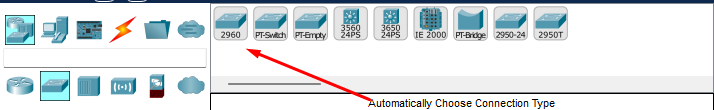
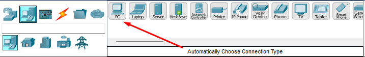
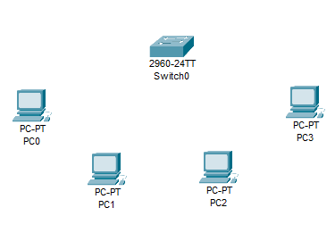
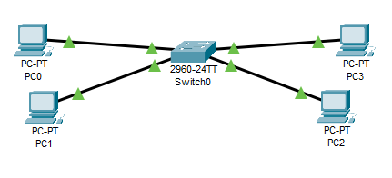
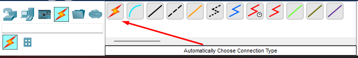
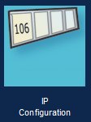
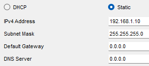
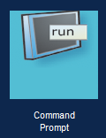
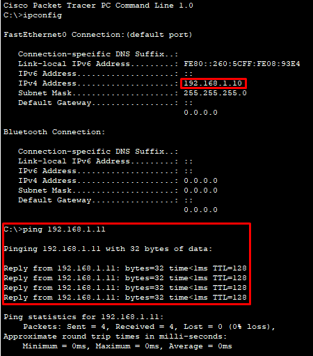

<h1>TASK 5 - CISCO PACKET TRACER NETWORK SIMULATION EXERCISES</h1>

<h4>CHRISTIAN MILLÁN SORIA</h4>

<h4>1º DAW TARDE</h4>

<b>1. Crear un entorno de red LAN con los siguientes elementos:</b>

<li><b>4 hosts pertenecientes a la red 192.168.1.X/24</b></li>

<li><b>Un switch ovn 24 puertos</b></li>

<b>Esta red debe simular el envío de PDUs entre los equipos de la misma.</b>

Lo primero es establecer los elementos:

Establezco las conexiones switch-host para que todos los hosts pertenezcan a una misma red.

*Por ahora conexiones automáticas, ya que no se especifica lo contrario.

Lo siguiente es configurar los propios equipos. Empiezo por el primero.

Me a la configuración del PC0 (clic en él). Entro en la pestaña de "Desktop", y ahí en "IP Configuration".

Una vez dentro, selecciono una dirección IP fija para este equipo (he empezado por la 192.168.1.10, por ejemplo; los otros hosts serán la 11, 12 y 13, respectivamente) y una máscara de subred.

Hago lo mismo para el resto de hosts, cambiando únicamente la IP fija en cada uno de ellos.

Cuando cada equipo tiene una IP, es fácil comprobar que la conexión entre ellos se puede realizar. Un método para esto es el comando "ping", por ejemplo.

Abro la terminal de comandos en la pestaña "Desktop" del primer host.

Compruebo que la Ip de este equipo es, efectivamente, la 192.168.1.10 y realizo un ping al segundo host. Como se puede ver en la foto, el envío y recibimiento de paquetes funciona correctamente (se puede realizar en otros hosts y con combinaciones diferentes para comprobar que todos están bien configurados):

Teniendo los hosts configurados, ya se puede realizar la comunicación utilizando PDUs entre los equipos. Para hacer esto, hago clic en el botón con forma de sobre en la parte superior (PDU), selecciono el emisor y el receptor (en ese orden).

Aquí se pueden ver algunas pruebas de comunicación realizadas que han resultado exitosas, los equipos pueden enviarse PDUs entre ellos:

<b>2. </b>
