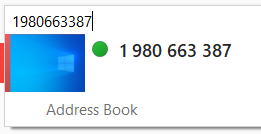
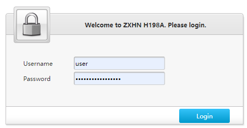
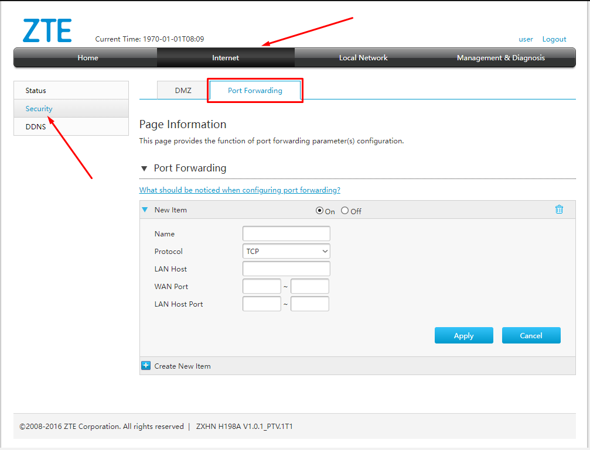

<h1>TASK 6 - RDP ACCESS TO WINDOWS HOSTS</h1>

<h4>CHRISTIAN MILLÁN SORIA</h4>

<h4>1º DAW TARDE</h4>

<b>1. Servidor remoto. ¿Qué es necesario configurar en el host de Windows al que queremos acceder?</b>

Para configurar el acceso remoto en un host de Windows al que deseas acceder, debes seguir los siguientes pasos:

<li>Verifica la edición de Windows: Asegúrate de que el host de Windows tenga una edición compatible con el acceso remoto. En general, las ediciones profesionales, como Windows 10 Pro o Windows Server, admiten la función de Escritorio remoto, mientras que las ediciones domésticas, como Windows 10 Home, pueden tener limitaciones o requerir soluciones alternativas.</li>

<li>Habilita la función de Escritorio remoto: Para habilitar el acceso remoto, haz lo siguiente:</li>

Haz clic derecho en el menú "Inicio" y selecciona "Sistema".

En la ventana de Configuración del sistema, selecciona "Configuración avanzada del sistema".

En la pestaña "Remoto", marca la opción "Permitir que los usuarios se conecten de forma remota a este equipo".

Opcionalmente, puedes hacer clic en "Seleccionar usuarios" para especificar qué usuarios o grupos tienen permiso para acceder de forma remota.

<li>Configura el enrutamiento y acceso remoto (opcional): Si deseas permitir el acceso remoto desde fuera de tu red local, es posible que necesites configurar el enrutamiento y acceso remoto en tu enrutador o firewall para redirigir los puertos necesarios al host de Windows.</li>

<li>Configura la red y la seguridad: Asegúrate de que el host de Windows esté correctamente conectado a la red y tenga una dirección IP válida. Además, considera configurar las medidas de seguridad apropiadas, como cortafuegos y software antivirus, para proteger el host de accesos no autorizados.</li>

Una vez que hayas completado estos pasos, podrás acceder al host de Windows de forma remota utilizando una herramienta de acceso remoto como el Escritorio remoto de Windows, ingresando la dirección IP o el nombre de host del equipo al que deseas conectarte.

<b>2. Reenvío de puertos del enrutador remoto. ¿Qué es el reenvío de puertos? ¿Qué acciones son necesarias realizar en el enrutador que actúa como puerta de enlace para el host de Windows al que queremos acceder?</b>

El reenvío de puertos, conocido como "port forwarding" en inglés, es un procedimiento esencial para permitir el acceso remoto a un dispositivo o host en una red local desde Internet. Consiste en redirigir el tráfico entrante desde un puerto específico del enrutador hacia un host específico en la red.

A continuación, los pasos necesarios para configurar el reenvío de puertos en el enrutador que actúa como puerta de enlace para el host de Windows al que se desea acceder:

<li>Accede a la interfaz de administración del enrutador. Para ello, abre un navegador web e ingresa la dirección IP del enrutador en la barra de direcciones. Por lo general, la dirección IP predeterminada es 192.168.1.1 o 192.168.0.1, pero puede variar según el fabricante del enrutador.</li>

<li>Inicia sesión en la interfaz de administración del enrutador utilizando las credenciales de acceso. Estas credenciales suelen ser proporcionadas por el fabricante o pueden haber sido configuradas previamente.</li>

<li>Busca la sección de "Reenvío de puertos" o "Port Forwarding" en la configuración del enrutador. La ubicación exacta puede variar según el enrutador y la versión de firmware que estés utilizando.</li>

<li>Dentro de la sección de reenvío de puertos, deberás agregar una regla de reenvío de puerto para el host de Windows al que deseas acceder. Esto implicará proporcionar la dirección IP local del host y el número de puerto que deseas reenviar.</li>

<li>Especifica el protocolo de red que deseas reenviar, como TCP o UDP.</li>

<li>Guarda la configuración y reinicia el enrutador si es necesario para que los cambios surtan efecto.</li>

<b>3. Lado del cliente. Explícame cómo conectar un servidor RDP utilizando un servicio de DDNS gratuito, ya que el sitio del servidor no tiene una IP pública fija.</b>

Si el servidor no tiene una IP pública fija y deseas conectarte a través de RDP utilizando un servicio de DDNS gratuito, puedes seguir los siguientes pasos:

<li>Obtén una cuenta en un servicio de DDNS gratuito: Existen varios servicios gratuitos de DDNS disponibles, como No-IP, DynDNS y DuckDNS. Crea una cuenta en uno de estos servicios y configura un nombre de host personalizado.</li>

<li>Configura el DDNS en tu router: Accede a la configuración de tu router y busca la sección de DDNS o Dynamic DNS. Allí deberás ingresar la información de tu cuenta de DDNS, incluyendo el nombre de host, el proveedor de DDNS y las credenciales de inicio de sesión. Guarda la configuración.</li>

<li>Configura el reenvío de puertos en tu router: Para permitir el acceso RDP desde Internet, debes configurar el reenvío de puertos en tu router. Normalmente, esto se encuentra en la sección de "Reenvío de puertos" o "Virtual Server" de la configuración del router. Debes redirigir el puerto RDP (por defecto es el puerto 3389) al dispositivo que aloja el servidor RDP en tu red local. Asegúrate de guardar la configuración.</li>

<li>Configura el cliente RDP: En tu PC cliente, abre el cliente RDP (por ejemplo, el "Escritorio remoto de Windows") e introduce el nombre de host que configuraste en el servicio de DDNS. Si el servicio de DDNS está funcionando correctamente, se asociará automáticamente con la dirección IP pública actualizada de tu servidor.</li>

<li>Conéctate al servidor RDP: Una vez que hayas ingresado el nombre de host del DDNS en el cliente RDP, haz clic en "Conectar" y se establecerá la conexión RDP con el servidor a través de la dirección IP pública actualizada proporcionada por el servicio de DDNS.</li>

<b>4. Windows 10 Pro no permite múltiples conexiones de RDP, pero es posible aplicar un parche para solucionarlo. Lee sobre RDP Wrapper en el enlace adjunto y aplícalo.</b>

En Windows 10 Pro, por defecto, solo se permite una sesión de RDP activa en un momento dado. Sin embargo, si deseas permitir múltiples conexiones RDP simultáneas, es posible aplicar un parche llamado "RDP Wrapper". Este parche permite modificar el archivo de configuración de Windows que controla el número de conexiones RDP simultáneas permitidas.

Para aplicar el parche RDP Wrapper, sigue los siguientes pasos:

<li>Descarga el archivo de RDP Wrapper desde el sitio web oficial: El archivo está disponible en GitHub en el siguiente enlace: <a href="https://github.com/stascorp/rdpwrap/releases">https://github.com/stascorp/rdpwrap/releases</a>.</li>

Adicionalmente, adjunto el enlace que aparece en el classroom: <a href="https://github.com/stascorp/rdpwrap/pull/1160">https://github.com/stascorp/rdpwrap/pull/1160</a>

<li>Descomprime el archivo: Extrae el contenido del archivo ZIP descargado en una carpeta en tu PC.</li>

<li>Ejecuta el instalador: Navega a la carpeta donde descomprimiste el archivo de RDP Wrapper y ejecuta el archivo "install.bat" con permisos de administrador. Este archivo agregará las entradas necesarias al archivo de configuración de Windows para permitir múltiples conexiones RDP simultáneas.</li>

<li>Verifica que la instalación se realizó correctamente: Abre el archivo "RDPCheck.exe" en la misma carpeta y verifica que todos los valores muestren "OK". Si hay algún error, sigue las instrucciones que se muestran para solucionar el problema.</li>

<li>Reinicia el equipo: Después de aplicar el parche, reinicia el equipo para que los cambios surtan efecto.</li>

Una vez que hayas aplicado el parche RDP Wrapper, podrás conectarte a tu PC a través de múltiples sesiones de RDP de forma simultánea. Sin embargo, ten en cuenta que esto puede tener implicaciones de seguridad, ya que permite que múltiples usuarios accedan a la misma PC al mismo tiempo. Asegúrate de tomar las medidas de seguridad necesarias para proteger tu PC y la información que contiene.
