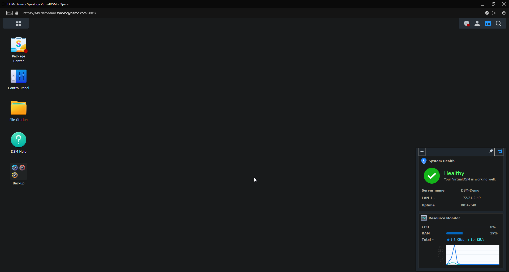
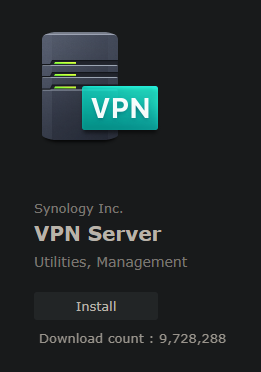
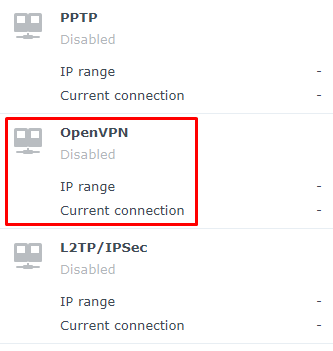
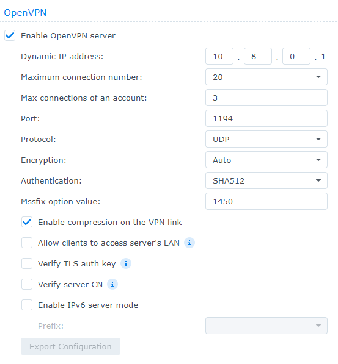
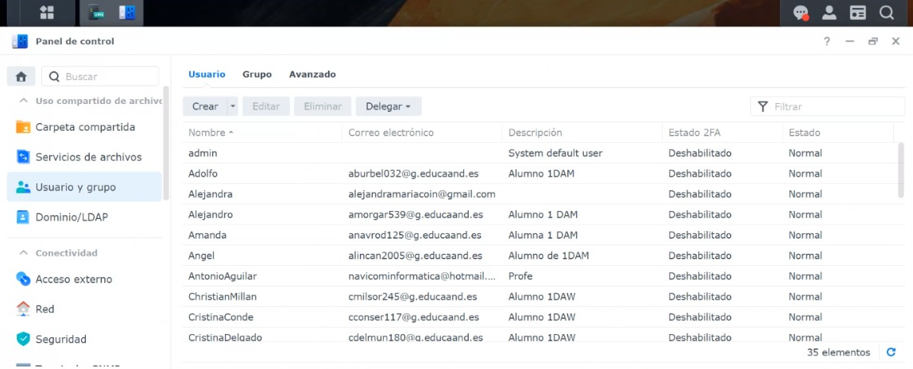
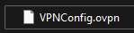
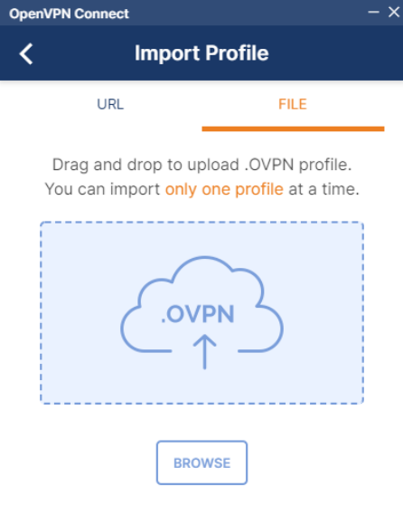
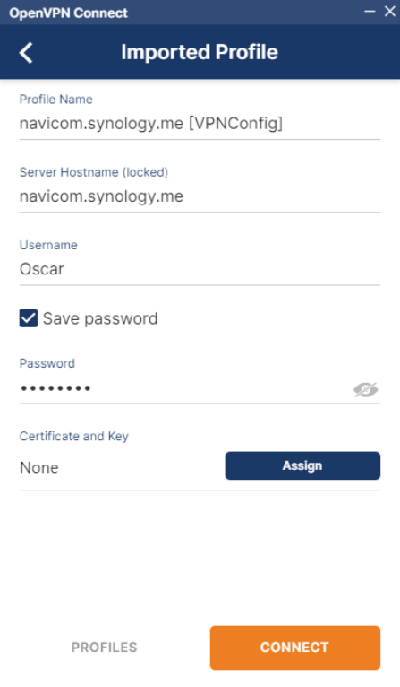
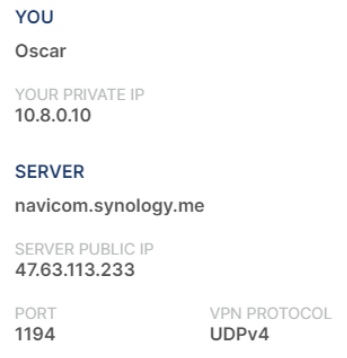
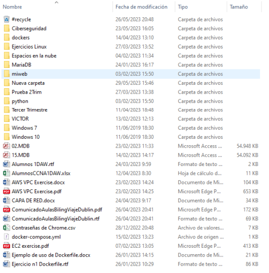

<h1>TASK 7 - OPEN-VPN with SINOLOGY</h1>

<h4>CHRISTIAN MILLÁN SORIA</h4>

<h4>1º DAW TARDE</h4>

<b>1. Explica qué es OPEN-VPN y todo lo necesario para configurar un servidor OPEN-VPN en un NAS Synology, así como las acciones a tomar en la puerta de enlace de la red local para realizar el reenvío de puertos a este servidor OPEN-VPN.</b>

OPEN-VPN es un software de código abierto que proporciona una conexión segura y privada a través de una red pública, utilizando el protocolo VPN (Virtual Private Network). Permite a los usuarios acceder a recursos de red de forma remota y proteger su conexión de posibles amenazas.

Para configurar un servidor OPEN-VPN en un NAS Synology, es necesario realizar los siguientes pasos:

<li>Asegurarse de tener un NAS Synology compatible con la funcionalidad de servidor VPN. No todos los modelos lo admiten.</li>

<li>Instalar el paquete VPN Server en el NAS Synology. Esto se puede hacer a través del centro de paquetes en la interfaz de administración del NAS.</li>

<li>Configurar los ajustes básicos del servidor VPN, como el nombre del servidor, el rango de direcciones IP para los clientes VPN, los protocolos de seguridad, etc.</li>

<li>Generar certificados y claves de seguridad para el servidor y los clientes VPN. Esto se puede hacer utilizando las herramientas integradas en el paquete VPN Server.</li>

<li>Configurar los ajustes de autenticación y cifrado según las preferencias de seguridad.</li>

<li>Abrir el puerto en el enrutador (gateway) para permitir el acceso externo al servidor OPEN-VPN en el NAS Synology. Esto se conoce como reenvío de puertos (port forwarding).</li>

<li>Configurar las reglas de reenvío de puertos en el enrutador para redirigir el tráfico entrante en el puerto seleccionado hacia la dirección IP interna del NAS Synology.</li>

<li>Verificar que el servidor OPEN-VPN esté funcionando correctamente y realizar las pruebas necesarias para conectarse a él de forma remota.</li>

<b>2. Exporta el archivo de configuración de OpenVPN al cliente de OpenVPN para Windows y prueba la conexión y el acceso a las carpetas compartidas del NAS.</b>

He utilizado el simulador que aparece en el PDF de la práctica para realizar esta tarea.

Al entrar en <a href="https://demo.synology.com/es-es/dsm">este enlace</a> elegí la opción "Pruebe DSM 7.2", el cual es un simulador preparado para poder realizar esta tarea.

Una vez dentro de la máquina (tarda en cargar un poco), me encuentro con el escritorio del NAS en el que trabajaré.

Me dirijo al menú de aplicaciones y busco la aplicación "VPN Server" y la instalo.

Abro la aplicación y veo que hay tres opciones de VPN. Me centraré en OpenVPN.

Abajo a la izquierda entro en la configuración del mismo.

Dentro de aquí, habilito el servicio de OpenVPN. Una vez hecho esto, configuro algunos parámetros: establezco una dirección IP, el número máximo de conexiones con el servidor, el número de conexiones máximas por usuario, el puerto predeterminado del servicio (dejo el 1194) y el protocolo (dejo UDP).

Aplico los cambios.

Lo siguiente sería crear un usuario y darle privilegios para trabajar dentro de la red, pero como estoy trabajando con un simulador, no puedo hacer esto. A continuación adjunto una captura del servidor del profesor donde sí que aparecen algunos usuarios ya creados y con permisos, entre los que aparece mi usuario:

El siguiente paso es realizar un redireccionamiento de puertos para este protocolo, de la misma manera que hice en la práctica de RDP. Entraría en la configuración del router de Vodafone que se encuentra en Navicom -> Configuración Avanzada -> Redirección de puertos -> creo una nueva regla que establezca el puerto UDP (TPC opcional) y redirija el puerto 1194 al mismo puerto, que se dirigirá a la IP 192.168.10.12, que es el servidor con el que estamos trabajando.

Una vez realizado todo esto, me dirigo a mi máquina personal. Instalo el cliente de OpenVPN desde <a href="https://openvpn.net/client/client-connect-vpn-for-windows/">este enlace</a>.

Previamente me he descargado el archivo de configuración de la VPN que el profesor ha exportado desde su servidor y nos ha enviado por correo:

Una vez instalado el cliente de OpenVPN, me dirijo a importar el archivo de configuración.

Este archivo tiene dentro cambiado el texto "YOUR_SERVER_IP" por el dominio "navicom.synology.com" para que la conexión se desarrolle sin problemas.

Debido a que me ha sido imposible iniciar sesión con mi perfil de usuario (puede que debido a que la contraseña no es la correcta o que no tengo los permisos suficientes), el compañero Óscar Mateo de 1º de DAM me ha prestado sus credenciales para poder terminar de realizar la práctica.

Una vez dentro de la red mediante la VPN, puedo escribir la dirección "\\192.168.10.12" para acceder al gestor de archivos del servidor y ver los archivos que hay disponibles dentro de él.

